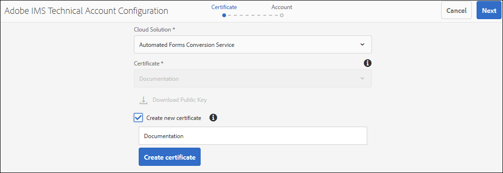

# Configurar o serviço de conversão automática de formulários {#about-this-help}

Esta ajuda descreve como um administrador de AEM pode configurar o serviço Automated forms conversion para automatizar a conversão de seus PDF forms em formulários adaptáveis. Essa ajuda destina-se aos administradores de TI e de AEM da sua organização. As informações fornecidas baseiam-se no pressuposto de que qualquer pessoa que leia esta Ajuda está familiarizada com as seguintes tecnologias:

* Instalação, configuração e administração de pacotes Adobe Experience Manager e AEM,

* Utilizando sistemas operacionais Linux® e Microsoft® Windows®,

* Configuração de servidores de email SMTP

<!--- >[!VIDEO](https://video.tv.adobe.com/v/29267/) 

**Watch the video or read the article to configure Automated Forms Conversion service** -->

## Integração{#onboarding}

O serviço está disponível gratuitamente para AEM 6.4 Forms e AEM 6.5 clientes de vigência no local do Forms e clientes corporativos do Adobe Managed Service. Você pode entrar em contato com a equipe de vendas da Adobe ou com seu representante da Adobe para solicitar acesso ao serviço. O serviço também está disponível gratuitamente e pré-ativado para clientes do AEM Forms as a Cloud Service.

A Adobe habilita o acesso para sua organização e fornece os privilégios necessários à pessoa designada como administrador em sua organização. O administrador pode conceder acesso aos desenvolvedores (usuários) do AEM Forms de sua organização para se conectar ao serviço.

## Pré-requisitos {#prerequisites}

Você precisa do seguinte para usar o Automated forms conversion Service:

* O serviço Automated forms conversion está ativado para a sua organização
* Uma conta Adobe ID com privilégios de administrador para o serviço de conversão
* Um AEM 6.4, AEM 6.5 ou AEM Forms como autor de Cloud Service com o Service Pack de AEM mais recente ou atualizações mais recentes.
* Um usuário AEM (em sua instância de AEM) que é membro do grupo forms-user

## Configurar o ambiente {#setuptheservice}

Antes de usar o serviço, prepare a instância do autor do AEM para se conectar ao serviço em execução no Adobe Cloud. Execute as seguintes etapas na sequência listada para preparar sua instância para o serviço:

1. [Baixe e instale o AEM 6.4, AEM 6.5 ou o AEM Forms integrado como um Cloud Service](#aemquickstart)
1. [Baixe e instale o AEM Service Pack mais recente](#servicepack)
1. [Baixe e instale o pacote complementar mais recente do AEM Forms](#downloadaemformsaddon)
1. (opcional) [Baixe e instale o pacote de conectores mais recente](#installConnectorPackage)
1. [Criar temas e modelos personalizados](#referencepackage)

### Baixe e instale o AEM 6.4 ou AEM 6.5 ou o AEM Forms integrado como um Cloud Service {#aemquickstart}


O serviço Automated forms conversion é executado AEM instância do autor. Você precisa AEM 6.4, AEM 6.5 ou AEM Forms como Cloud Service para configurar uma instância de autor de AEM.

* Se você não tiver o AEM 6.4 ou AEM 6.5 em execução, baixe-o dos locais abaixo. Depois de baixar o AEM, para obter instruções sobre como configurar uma instância de autor de AEM, consulte [implantando e mantendo](https://helpx.adobe.com/experience-manager/6-5/sites/deploying/using/deploy.html#defaultlocalinstall):

   * Se você for um cliente AEM existente, baixe o AEM 6.4 ou o AEM 6.5 do [Adobe Licensing website](http://licensing.adobe.com).

   * Se você for um parceiro de Adobe, use [Adobe Partner Training Program](https://adobe.allegiancetech.com/cgi-bin/qwebcorporate.dll?idx=82357Q) para solicitar AEM 6.4 ou AEM 6.5.

* Se estiver usando o AEM Forms como um Cloud Service, consulte integrado no [AEM Forms as a Cloud Service](https://experienceleague.adobe.com/docs/experience-manager-forms-cloud-service/forms/setup-environment/setup-forms-cloud-service.html?lang=en#setup-environment) e [configure um ambiente de desenvolvimento local](https://experienceleague.adobe.com/docs/experience-manager-forms-cloud-service/forms/setup-environment/setup-local-development-environment.html?lang=en#setup-environment).

### (Somente para AEM 6.4 e AEM 6.5) Baixe e instale AEM Service Pack mais recente {#servicepack}

Baixe e instale o AEM Service Pack mais recente. Para obter instruções detalhadas, consulte ou [AEM 6.4 Notas de versão do Service Pack](https://helpx.adobe.com/br/experience-manager/6-4/release-notes/sp-release-notes.html) ou [AEM 6.5 Notas de versão do Service Pack](https://helpx.adobe.com/br/experience-manager/6-5/release-notes/sp-release-notes.html).

### (Somente para AEM 6.4 e AEM 6.5) Baixe e instale o pacote do complemento AEM Forms {#downloadaemformsaddon}

Uma instância AEM contém recursos básicos de formulários. O serviço de conversão requer recursos completos do AEM Forms. Baixe e instale o pacote complementar do AEM Forms para aproveitar todos os recursos do AEM Forms. O pacote é necessário para configurar e executar o serviço de conversão. Para obter instruções detalhadas, consulte [Instalar e configurar recursos de captura de dados.](https://helpx.adobe.com/br/experience-manager/6-5/forms/using/installing-configuring-aem-forms-osgi.html)

>[!NOTE]
> Certifique-se de executar as configurações de pós-instalação obrigatórias após instalar o pacote complementar.


<!-- ### (Optional) Download and install connector package  {#installConnectorPackage}

The connector package provides early access to the [Auto-detect logical sections](convert-existing-forms-to-adaptive-forms.md#run-the-conversion) features and improvements delivered in release AFC-2020.03.1. Do not install the package if you do not require feature and improvements delivered in AFC-2020.03.1.  You can [download the connector package from AEM Package Share](https://www.adobeaemcloud.com/content/marketplace/marketplaceProxy.html?packagePath=/content/companies/public/adobe/packages/cq650/featurepack/AFCS-Connector-2020.03.1). -->


### Criar temas e modelos personalizados {#referencepackage}

Se você iniciar AEM 6.4 ou AEM 6.5 no [modo de produção](https://helpx.adobe.com/experience-manager/6-5/sites/administering/using/production-ready.html) (modo de execução nosamplecontent), os pacotes de referência não serão instalados. Os pacotes de referência contêm temas e modelos de amostra. O serviço Automated forms conversion requer pelo menos um tema e um modelo para converter um formulário PDF em um formulário adaptável. Crie um tema e modelo personalizados próprios e aponte [configuração de serviço](#configure-the-cloud-service) para usar modelos e temas personalizados antes de usar o serviço.

Você também pode baixar e instalar o pacote [Ativos de referência do AEM Forms](https://experience.adobe.com/#/downloads/content/software-distribution/en/aemcloud.html) em sua instância do autor. Ele cria alguns temas e modelos de referência.

## Configurar o serviço {#configure-the-service}

Antes de continuar a configurar o serviço e conectar sua instância local ao serviço em execução na Adobe Cloud, saiba mais sobre as personas e os privilégios necessários para se conectar ao serviço. O serviço usa dois tipos diferentes de personas, administradores e desenvolvedores:

* **Administradores**: Os administradores são responsáveis pelo gerenciamento de software e serviços Adobe para sua organização. Os administradores concedem acesso aos desenvolvedores em sua organização para se conectar ao serviço do Automated forms conversion em execução na Adobe Cloud. Quando um administrador é provisionado para uma organização, o administrador recebe um email com o título **[!UICONTROL 'You now have administrator rights to manage Adobe software and services for your organization']**. Se você for um administrador, verifique sua caixa de correio para obter um email com o título mencionado anteriormente e prossiga para [conceder acesso aos desenvolvedores de sua organização](#adduseranddevs).


* **Desenvolvedores**: Um desenvolvedor conecta uma instância de autor local do AEM Forms ao serviço Automated forms conversion em execução no Adobe Cloud. Quando um administrador concede direitos a um desenvolvedor para se conectar ao serviço do Automated forms conversion, um email com o título Você agora tem acesso de desenvolvedor para gerenciar integrações da API do Adobe para que sua organização seja enviado ao desenvolvedor. Se você for um desenvolvedor, verifique sua caixa de correio para obter um email com o título mencionado anteriormente e prossiga para [Conecte sua instância de AEM local ao serviço Automated forms conversion na Adobe Cloud.](#connectafcadobeio)


### (Somente para administradores do AEM 6.4 e AEM 6.5) Conceder acesso aos desenvolvedores de sua organização {#adduseranddevs}

Depois que o Adobe habilitar o acesso para sua organização e fornecer os privilégios necessários ao administrador, o administrador poderá fazer logon no Admin Console (instruções detalhadas abaixo), criar um perfil e adicionar desenvolvedores ao perfil. Os desenvolvedores podem conectar uma instância local do AEM Forms ao serviço Automated forms conversion na Adobe Cloud.

Os desenvolvedores são membros de sua organização designados para executar o serviço de conversão. Somente os desenvolvedores adicionados ao perfil de serviço do Adobe Automated forms conversion têm direito de usar o serviço Automated forms conversion. Execute as etapas abaixo para criar um perfil e adicionar desenvolvedores a ele. Um mínimo de um perfil é necessário para conceder o acesso necessário aos desenvolvedores de sua organização:

1. Faça logon em [Admin Console](https://adminconsole.adobe.com/). Use **Adobe ID** do administrador provisionado para usar o serviço Automated forms conversion para fazer logon. Não faça logon com outra ID ou Federated ID.
1. Clique na opção **[!UICONTROL Automated Forms Conversion]**.
1. Clique em **[!UICONTROL New Profile]** na guia **[!UICONTROL Products]**.
1. Especifique **[!UICONTROL Name]**, **[!UICONTROL Display Name]** e **[!UICONTROL Description]** para o perfil. Clique em **[!UICONTROL Done]**. Um perfil é criado.

   

1. Adicione desenvolvedor ao perfil. Para adicionar os desenvolvedores:
   1. No [Admin Console](https://adminconsole.adobe.com/enterprise), navegue até a guia Visão geral .
   1. Clique em **[!UICONTROL Assign Developers]** no cartão de produto necessário.
   1. Insira o endereço de email dos desenvolvedores e, opcionalmente, o nome e sobrenome.
   1. Selecione perfis de produto. Tocar **[!UICONTROL Save]**.

Repita as etapas acima para todos os usuários. Para obter mais detalhes sobre como adicionar desenvolvedores, consulte [Gerenciar desenvolvedores](https://helpx.adobe.com/enterprise/using/manage-developers.html).

Depois que um administrador adiciona desenvolvedores ao perfil do Adobe I/O, os desenvolvedores são notificados por email. Depois de receber o email, os desenvolvedores podem prosseguir para [conectar uma instância local do AEM Forms com o serviço Automated forms conversion na Adobe Cloud](#connectafcadobeio).

### (Somente para desenvolvedores) Conecte sua instância local do AEM Forms ao serviço Automated forms conversion na Adobe Cloud {#connectafcadobeio}

Depois que um administrador fornecer acesso de desenvolvedor, você poderá conectar sua instância local do AEM Forms ao serviço Automated forms conversion em execução na Adobe Cloud. Execute as seguintes etapas na sequência listada para conectar a instância do AEM Forms ao serviço:

* [Configurar notificações por email](configure-service.md#configureemailnotification)
* [Adicionar usuário ao grupo usuários de formulários](#adduserstousergroup)
* [Obter certificados públicos](#obtainpubliccertificates)
* [Configurar as APIs de serviço no Console do desenvolvedor do Adobe](#createintegration)
* [Configurar o serviço em nuvem](configure-service.md#configure-the-cloud-service)

#### Configurar notificação por email {#configureemailnotification}

O serviço Automated forms conversion usa o serviço de email Day CQ para enviar notificações por email. Essas notificações por email contêm informações sobre conversões bem-sucedidas ou com falha. Se você optar por não receber a notificação, ignore essas etapas. Execute as seguintes etapas para configurar o Day CQ Mail Service:

* Para AEM 6.4 Forms ou AEM 6.5 Forms:

   1. Vá para AEM gerenciador de configuração em `http://localhost:4502/system/console/configMgr`
   1. Abra a configuração do Day CQ Mail Service. Especifique um valor para os campos **[!UICONTROL SMTP server host name]**, **[!UICONTROL SMTP server port]** e **[!UICONTROL From address]**. Clique em **[!UICONTROL Save]**.

      Você pode entrar em contato com seu provedor de serviços de email ou administrador de TI para obter informações sobre o nome do host e a porta do servidor SMTP. Você pode usar qualquer endereço de email válido no campo de formulário. Por exemplo, notification@example.com ou donotreply@example.com.

   1. Abra a configuração **[!UICONTROL Day CQ Link Externalizer]**. No campo **[!UICONTROL Domains]** , especifique o nome do host ou endereço IP real e o número da porta para instâncias locais, de autor e de publicação. Clique em **[!UICONTROL Save]**.

* Para o AEM Forms as a Cloud Service, [registre um tíquete de suporte para habilitar o serviço de email](https://experienceleague.adobe.com/docs/experience-manager-cloud-service/implementing/developing/development-guidelines.html?lang=en#sending-email).

#### Adicionar usuário ao grupo de usuários de formulários {#adduserstousergroup}

Especifique um endereço de email no perfil do usuário AEM designado para executar o serviço. Certifique-se de que o usuário seja o membro do grupo [forms user](https://helpx.adobe.com/experience-manager/6-4/forms/using/forms-groups-privileges-tasks.html). Os emails são enviados para o endereço de email do usuário que está executando a conversão. Para especificar um endereço de e-mail para o usuário e adicionar usuário ao grupo de usuários`e forms:

1. Faça logon na instância do autor do AEM Forms como administrador AEM. Use suas credenciais de AEM local para fazer logon. Não use o Adobe ID para fazer logon. Toque em **[!UICONTROL Adobe Experience Manager]** > **[!UICONTROL Tools]** > **[!UICONTROL Security]** > **[!UICONTROL Users]**.

1. Selecione um usuário designado para executar o serviço de conversão e toque em **[!UICONTROL Properties]**. A página Editar configurações do usuário é aberta.
1. Especifique um endereço de email no campo **[!UICONTROL Email]** e toque em **[!UICONTROL Save]**. Os emails são enviados para o endereço de email especificado na conclusão bem-sucedida ou na falha da conversão.
1. Toque na guia **Grupos**. Na guia selecionar grupo , digite e selecione o grupo **forms-users**. Toque em **Salvar e fechar**. O usuário agora é membro do grupo usuários do formulário.

#### (Somente para AEM 6.4 e AEM 6.5) Obter certificados públicos {#obtainpubliccertificates}

Um certificado público permite autenticar seu perfil no Adobe I/O.

1. Faça logon na instância do autor do AEM Forms. Vá até **[!UICONTROL Tools]**> **[!UICONTROL Security]** > **[!UICONTROL Adobe IMS Configurations]**. Tocar **[!UICONTROL Create]**. A página **[!UICONTROL Adobe IMS Technical Account Configuration]** é exibida.

   

1. Selecione **[!UICONTROL Automated Forms Conversion Service]** na Solução da nuvem.

1. Marque a caixa de seleção **[!UICONTROL Create new certificate]** e especifique um alias. O alias atua como nome da caixa de diálogo. Tocar **[!UICONTROL Create certificate]**. Uma caixa de diálogo é exibida. Clique em **[!UICONTROL OK]**. O certificado é criado.

1. Toque em **[!UICONTROL Download Public Key]** e salve o arquivo de certificado *AEM-Adobe-IMS.crt* no computador. O arquivo de certificado é usado para [Configurar as APIs de serviço no Console do Desenvolvedor do Adobe](#createintegration). Tocar **[!UICONTROL Next]**.

1. Especifique o seguinte:

   * Título: Especifique um título.
   * Servidor de autorização: [https://ims-na1.adobelogin.com](https://ims-na1.adobelogin.com)\

   Deixe os outros campos em branco por enquanto (a ser fornecido posteriormente). Mantenha a página aberta.

   <!--
   Comment Type: draft

   <li> </li>
   -->

   <!--
   Comment Type: draft

   <li>Step text</li>
   -->

#### (Somente para AEM 6.4 e AEM 6.5) Configure as APIs de serviço no Console do desenvolvedor do Adobe {#createintegration}

Para usar o serviço Automated forms conversion, crie um projeto e adicione a API do Serviço de configuração automatizada do Forms ao projeto no Console do desenvolvedor do Adobe. A integração gera a Chave da API, Segredo do cliente, Carga (JWT).

1. Faça logon em [https://console.adobe.io/](https://console.adobe.io/). Use sua conta de desenvolvedor do Adobe ID que seu administrador provisionou para fazer logon no console do Adobe I/O para fazer logon.
1. Selecione sua organização no canto superior direito. Se não souber sua organização, entre em contato com o administrador.
1. Tocar **[!UICONTROL Create new project]**. Uma tela para começar a usar o novo projeto é exibida. Tocar **[!UICONTROL Add API]**. Uma tela com uma lista de todas as APIs ativadas para sua conta é exibida.
1. Selecione **[!UICONTROL Automated Forms Conversion service]** e toque em **[!UICONTROL Next]**. Uma tela para configurar a API é exibida.
1. Selecione a opção [!UICONTROL Upload your public key] , carregue o arquivo AEM-Adobe-IMS.crt baixado na seção [Obter certificados públicos](#obtainpubliccertificates) e toque em **[!UICONTROL Next]**. A opção Criar uma nova credencial de conta de serviço (JWT) é exibida. Tocar **[!UICONTROL Next]**.
1. Selecione um Perfil de produto e toque em **[!UICONTROL Save configured API]**. Selecione o perfil criado ao [conceder acesso aos desenvolvedores de sua organização](#adduseranddevs). Caso não saiba o perfil a ser selecionado, entre em contato com o administrador.
1. Toque em **[!UICONTROL Service Account (JWT)]** para exibir a Chave da API, o Segredo do cliente e outras informações necessárias para conectar a instância do AEM local ao serviço do Automated forms conversion. As informações na página são usadas para criar a configuração IMS no computador local.

1. Abra a página Configuração IMS na instância local. Você manteve a página aberta no final da seção, [Obter certificado público](#obtainpubliccertificates).

   

1. Na página Técnica do Adobe IMS, especifique a Chave da API e o Segredo do cliente. Use os valores especificados na Conta de serviço (JWT) da página do console Desenvolvedor do Adobe.

   >[!NOTE]
   >
   >
   >Para carga útil, use o código fornecido na guia Gerar JWT da página Conta de serviço (JWT) do Console do Desenvolvedor do Adobe.

1. Tocar **[!UICONTROL Save]**. A configuração IMS é criada.

   >[!CAUTION]
   >
   >Crie apenas uma configuração IMS. Não crie mais de uma configuração IMS.

1. Selecione a configuração IMS e toque em **[!UICONTROL Check Health]**. Uma caixa de diálogo é exibida. Tocar **[!UICONTROL Check]**. Ao se conectar com êxito, a mensagem *Token recuperado com êxito* é exibida.

   

   <br/> <br/>

#### Configure o Cloud Service {#configure-the-cloud-service}

Crie uma configuração de Cloud Service para conectar sua instância de AEM ao serviço de conversão. Também permite especificar um modelo, tema e fragmentos de formulário para uma conversão. É possível criar várias configurações do serviço de nuvem separadas para cada conjunto de formulários. Por exemplo, você pode ter uma configuração separada para formulários do departamento de vendas e outra separada para formulários de suporte ao cliente. Execute as seguintes etapas para criar uma configuração do serviço de nuvem:

1. Na instância do AEM Forms, toque em **[!UICONTROL Adobe Experience Manager]** > **[!UICONTROL Tools]** > **[!UICONTROL Cloud Services]** > **[!UICONTROL Automate Forms Conversion Configuration]**.
1. Toque na pasta **[!UICONTROL Global]** e toque em **[!UICONTROL Create]**. A página para criar a configuração do Automated forms conversion é exibida. A configuração é criada na pasta Global . Você também pode criar a configuração em uma pasta diferente que existe ou criar uma pasta para suas configurações.

1. Na página **[!UICONTROL Create Automated Forms Conversion Configuration]** , especifique o valor dos seguintes campos e toque em **[!UICONTROL Next]**.

   | Texto | Descrição |
   |--- |--- |
   | Título | Título exclusivo para a configuração. O título é exibido na interface do usuário usada para iniciar a conversão. |
   | Nome | Nome exclusivo para a configuração. A configuração é salva no CRX-Repository com o nome especificado. O nome pode ser idêntico ao título. |
   | Localização em miniatura | Localização da miniatura da configuração. |
   | URL do serviço | URL do serviço Automated forms conversion na Adobe Cloud. Use o URL `https://aemformsconversion.adobe.io/`. |
   | Modelo | Modelo padrão a ser aplicado a formulários convertidos. Você sempre pode especificar um modelo diferente antes de iniciar a conversão. Um modelo contém a estrutura básica e o conteúdo inicial de um formulário adaptável. Você pode escolher um modelo nos modelos prontos para uso fornecidos. Você também pode criar um modelo personalizado. |
   | Tema | Tema padrão a ser aplicado a formulários convertidos. Você sempre pode especificar um tema diferente antes de iniciar a conversão.  Você pode clicar no ícone para escolher um tema fornecido imediatamente. Também é possível criar um tema personalizado. |
   | Fragmentos existentes | Localização dos fragmentos existentes, se houver. |
   | Meta-modelo personalizado | Caminho do arquivo .schema.json do metamodelo personalizado. |


1. Na guia **[!UICONTROL Advanced]** da página **[!UICONTROL Create Automated Forms Conversion Configuration]**, especifique o valor do seguinte campo:

   <table>
   <thead>
   <tr>
   <th>Texto</th>
   <th>Descrição</th>
   </tr>
   </thead>
   <tbody>
   <tr>
   <td >Gerar documento de registro</td>
   <td>Selecione a opção para gerar automaticamente o Documento de registro para formulários convertidos. A opção é apenas para formulários baseados em XFA (XDP e PDF forms). Ao habilitar a opção , após enviar um formulário, é possível permitir que os clientes mantenham um registro, em formato impresso ou de documento, das informações que preencheram no formulário para referência futura. Isso é chamado de documento de registro.</td>
   </tr>
   <tr>
   <td>Ativar Analytics</td>
   <td>(Somente para AEM 6.4 e AEM 6.5) Selecione a opção para ativar o Adobe Analytics em todos os formulários convertidos. Antes de usar a opção , verifique se o Adobe Analytics está ativado para sua instância do AEM Forms.</td>
   </tr>
   </tbody>
   </table>

   * Quando a origem é um formulário baseado em XFA com extensão .XDP, o DOR de saída retém o layout XFA, caso contrário, o serviço de conversão usa um modelo pronto para uso para gerar DOR para outros formulários baseados em XFA.
   * Quando um formulário XFA é enviado, os dados de envio do formulário são salvos como um elemento XML ou um atributo. Por exemplo, `<Amount currency="USD"> 10.00 </Amount>`. A moeda é salva como um atributo e a quantidade da moeda, 10.00 é salva como um elemento. Enviar dados de um formulário adaptável não tem atributos, ele tem apenas elementos. Portanto, quando um formulário baseado em XFA é convertido em formulário adaptável, os dados de envio do formulário adaptável contêm um elemento para cada atributo. Por exemplo,

   ```css
      {
         "Type": "Principal",
   
         "Amount": "10.00",
   
         "currency": "USD"
      }
   ```

1. Tocar **[!UICONTROL Create]**. A configuração da nuvem é criada. A instância do AEM Forms está pronta para iniciar a conversão de formulários herdados em formulários adaptáveis.
