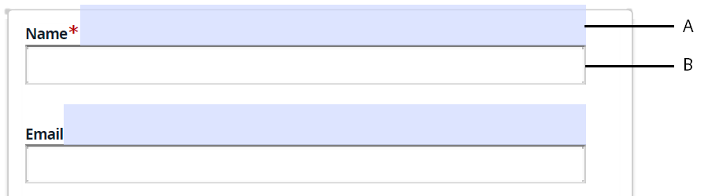

# Problemas conhecidos e limitações {#known-issues-limitations}

Antes de começar a usar o serviço de conversão de formulários automatizados do AEM Forms, analise os seguintes problemas conhecidos e limitações:

## Problemas conhecidos {#known-issues}

* A pasta que contém formulários para conversão não deve ter mais de 15 formulários e 50 páginas no total. O tamanho da pasta de origem não deve exceder 10 MB. Não crie subpastas na pasta de origem.
* Alguns objetos de formulário são facilmente visíveis para o olho humano, mas são [difíceis de identificar para o serviço](styles-and-pattern-considerations-and-best-practices.md). Use a opção [Revisar e corrigir editor](review-correct-ui-edited.md) para identificar e converter esses objetos de formulário.
* Editor de revisão e correção:

   * Não tem ação de desfazer. O botão Salvar salva as alterações permanentemente.
   * Não suporta painéis repetíveis para formulários baseados em XFA.
   * Se você modificar uma lista em uma tabela usando o editor Revisão e Correção, a largura da linha não se ajusta automaticamente e o texto pode se espalhar para a próxima linha da tabela.
   * O **[!UICONTROL Auto-detect multi-column layout from input forms]** recurso não funciona com o editor de Revisão e Correção e Fragmentos de formulário.
   * A assinatura de script criada com o editor de Revisão e Correção falha ao carregar para formulários adaptativos publicados.

* Para formulários baseados em XFA:
   * Não há suporte para a extração de fragmentos de um formulário baseado em XFA.
   * Scripts XFA não são suportados. Por exemplo, scripts para gerar valores automaticamente para um componente suspenso.
   * Metmodelo não funciona para o grupo de escolha
   * A opção Grupos de escolha com um único caractere não é identificada
   * Quando o documento de origem é um XFA dinâmico (.XDP) e [define o comportamento das propriedades XFA em um formulário](https://helpx.adobe.com/experience-manager/6-5/forms/using/xfa-api-supported-in-adaptive-form.html#supportedxfaelementsandtheirmappinginadaptiveformsbr)adaptável, a propriedade presence do documento de origem não é respeitada. Por exemplo, um campo no documento de origem é marcado como oculto e um script torna o campo visível e, em seguida, o campo permanece visível no formulário adaptável de saída.

* Ao usar a opção **Usar formulário de entrada como Documento de registro (DoR) para formulários** adaptativos gerados, considere o seguinte:

<table>
    <tr>
        <td>O vínculo e os dados são perdidos para campos de texto composto. Um campo de texto composto tem várias caixas de texto alinhadas entre si. Por exemplo, em um AcroForm, um número de cartão de crédito é dividido em várias caixas de texto e cada caixa de texto tem um vínculo separado. Quando o AcroForm é convertido em um formulário adaptável, o formulário adaptável convertido tem um único vínculo para todas as caixas de texto. Como solução, antes de converter um AcroForm em formulário adaptável, modifique o AcroForm para usar uma única caixa de texto para aceitar números de cartão de crédito.</td>
        <td>                                                            </td>
    </tr>
    <tr>
        <td>O vínculo e os dados são perdidos para campos de data compostos. Um campo de data composto é composto de três campos diferentes. Por exemplo, um campo de data de nascimento em um AcroForm é dividido em três campos separados. O formulário adaptável fornece um componente de seletor de datas pronto para uso. Para usar o componente do seletor de datas do formulário adaptável e, ao mesmo tempo, reter o vínculo do AcroForm, antes de converter um AcroForm em um formulário adaptável, modifique o AcroForm para usar um único campo de data.</td>
        <td></td>
    </tr>
    <tr>
        <td>Se o tamanho das caixas de seleção for maior que o texto que as acompanha, as caixas de seleção não serão detectadas e o vínculo no AcroForm será perdido. Modifique o AcroForm para tornar o tamanho das caixas de seleção menor que o texto que o acompanha.</td>
        <td> </td>
    </tr>
    <tr>
        <td>Se os campos de entrada não estiverem alinhados ao campo de texto correspondente, o campo de entrada não será detectado.  </td>
        <td></td>
    </tr>
    <tr >
        <td>O serviço converte todas as caixas de seleção de um AcroForm em grupos de escolha separados. Grupos de opções separados são criados para preservar vínculos com o AcroForm. Não mesclar grupos de opções no formulário adaptativo. Isso levará à perda de vínculos. Se você unir os grupos de opções, converta o formulário novamente para recuperar os vínculos perdidos. </td>
        <td></td>
    </tr>
    <tr >
        <td>Os limites de algumas tabelas são estendidos para fora da página no documento de registro (DoR) gerado automaticamente. </td>
        <td></td>
    </tr>
</table>

## Limitações          {#limitations}

* Não há suporte para PDF forms com layout dinâmico complexo, campos com contorno pontilhado, campos preenchidos ou campos coloridos.
* Imagens e texto dentro das imagens não são identificados. Adicione manualmente imagens a formulários convertidos.
* documentos XDP de arte não são suportados.
* Não há suporte para PDF forms maiores que 15 páginas.
* documentos criptografados, protegidos por senha e protegidos não são convertidos. Remova a criptografia ou as senhas antes de executar a conversão.
* Tabelas complexas como tabelas sem bordas, tabelas aninhadas, tabelas com linhas coloridas e tabelas com valores de espaço reservado não são suportadas. Use o editor de formulário adaptável para adicionar ou modificar tabelas complexas, após a conversão. Somente tabelas simples, com campos vazios, cabeçalhos adequados e limites de limpeza são suportados.
* O serviço converte somente formulários em inglês em formulários adaptáveis. You can translate converted adaptive forms to another language using [AEM translation workflow](https://helpx.adobe.com/br/experience-manager/6-5/forms/using/using-aem-translation-workflow-to-localize-adaptive-forms.html).
* O AEM 6.4 Forms não oferece suporte à detecção automática do layout de várias colunas de formulários de entrada.

