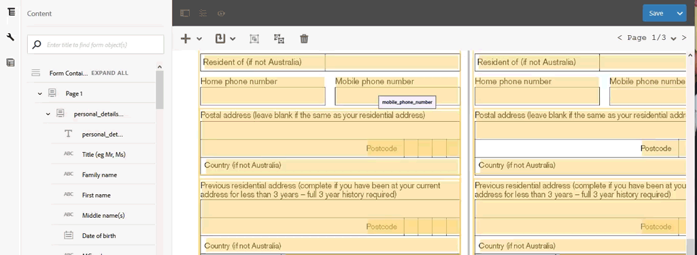

# Revisar e corrigir formulários convertidos{#review-and-correct-converted-forms}

O serviço de Automated forms conversion AEM Forms identifica campos, conteúdo e layout do documento PDF de entrada e converte o documento PDF em um formulário adaptável. O formulário adaptável de saída pode ter alguns campos ausentes ou convertidos incorretamente. Você pode usar o editor de Revisão e Correção para fazer melhorias nos campos identificados e gerar novamente o formulário adaptável para obter uma saída mais próxima à experiência desejada. Após a primeira conversão, você pode abrir o documento PDF de entrada no editor para:

* Visualização de todos os campos e conteúdos identificados durante a conversão
* Identificar os campos e o conteúdo perdidos durante a conversão
* Verificar o tipo de um campo e alterar seu tipo, se necessário
* Verifique as tabelas identificadas, redimensione as colunas e modifique o conteúdo da célula
* Remover campos incorretamente identificados

Depois de fazer as alterações necessárias, reenvie os PDF forms para o serviço de conversão. Em uma conversão bem-sucedida, os ativos atualizados, incluindo o formulário adaptável e o schema, são baixados para a instância do AEM Forms. Você pode repetir o processo até que a experiência desejada seja atingida. 

Você precisa do Google Chrome, Mozilla FireFox ou navegador Microsoft Edge para usar o editor de revisão e correção. O editor não oferece suporte ao Internet Explorer.

## Bem-vindo ao Editor de Revisão e Correção {#welcome-to-review-and-correct-editor}

O editor de Revisão e Correção fornece uma interface fácil de usar. Ele tem os seguintes componentes:

* Navegador de conteúdo: Você pode usar o navegador de conteúdo para alterar a posição de um elemento. O navegador de conteúdo permite que você arraste e solte um objeto de formulário para alterar sua posição. Por exemplo, mover uma tabela antes de uma caixa de texto. Ela altera a ordem de tabulação do formulário adaptável de saída de acordo.
* Navegador de propriedades: Exibe as propriedades de um campo selecionado. Também é possível modificar as propriedades.
* Barra de ferramentas: A barra de ferramentas fica na parte superior do editor. Ele exibe ferramentas para adicionar, modificar, agrupar, desagrupar e excluir campos.
* Abrir propriedades: A opção Abrir propriedades é exibida ao tocar no ícone . Você pode clicar em abrir as propriedades para abrir as propriedades do formulário e visualização outras opções.
* Botão Filtrar: O botão de filtro  está na parte superior do editor. Permite que você filtre os campos para exibir somente textos, campos, grupos de escolha, painéis ou todos os componentes.
* Botão Salvar: O botão **[!UICONTROL Save]** está no canto superior direito do editor. Também é possível usar a seta ao lado do botão Salvar para visualização da opção de envio do formulário para conversão.

* Formulário PDF: O editor exibe o documento PDF de origem e o sobrepõe aos campos identificados. Você pode usar as ferramentas da barra de ferramentas para modificar os campos.
* Páginas: Um formulário de origem pode ter várias páginas. O editor fornece um botão no canto superior direito para navegar entre as páginas.

**A.** Navegador de conteúdo  **B.** Propriedades Navegador  **C.** Barra de ferramentas  **D.** Propriedades Botão  **E.** Filtro Botão  ****   **** F.Save botão G.PDF sobrecarregado com campos identificados

Após a primeira conversão bem-sucedida, o serviço de conversão sobrepõe o documento PDF de origem com campos e componentes identificados. Esses campos ou componentes são do tipo: Texto, Campo, Painel, Grupo de escolha e tabela:

* Texto: Texto simples no documento PDF de origem. Por exemplo, o texto do Aplicativo de empréstimo na imagem exibida acima.
* Campo: Combinação de texto ou rótulo de ícone associado a um valor ou caixa de entrada. Por exemplo, o nome do campo Primeiro na imagem acima. Ele tem um rótulo de texto e uma caixa de entrada. Um campo suporta tipos de dados de texto, numérico, suspenso, data, email, número de telefone, assinatura, moeda e senha.
* Painel: Coleção lógica de conteúdo e componentes. Por exemplo, os painéis Detalhes pessoais da Pessoa 1 e da Pessoa 2 na imagem acima.
* Grupo de opções: Combinação de texto associado a várias opções de escolha: caixa de seleção e botão de opção. Por exemplo, o status Marital e Cliente existente na imagem acima.\
   Com base na legenda do grupo de opções e em suas opções de múltipla escolha, o serviço de conversão converte automaticamente um grupo de opções em um botão de opção de seleção única ou em uma caixa de seleção de várias opções. Por exemplo, se houver **Selecione qualquer um** como a legenda do grupo de escolha ou as opções de múltipla escolha permitem que você selecione apenas uma opção, **Yes** ou **No**, o serviço de conversão converte automaticamente o grupo de opções em um botão de opção de seleção única. Da mesma forma, se houver **Marque todas as opções que se aplicam** ou **Selecione várias** como a legenda do grupo de opções ou as opções de múltipla escolha permitem selecionar várias opções, o serviço de conversão converte automaticamente o grupo de opções em uma caixa de seleção de várias.

* Tabela: Uma tabela 2-d com informações representadas em colunas e linhas. É possível adicionar ou remover linhas ou colunas de uma tabela.

## Start revisando uma conversão {#start-reviewing-a-conversion}

Após a primeira conversão bem-sucedida, o serviço de conversão sobrepõe o documento PDF de origem com campos e componentes identificados. É possível fazer melhorias nos campos identificados e gerar novamente o formulário adaptável para obter uma saída mais próxima da experiência desejada. Você pode start para revisar uma conversão somente após a primeira conversão bem-sucedida.

### Antes de você iniciar {#before-you-start}

* O editor de revisão e correção não oferece suporte a fragmentos. Não use o editor para revisar as conversões que tiveram a opção **Extrair fragmento** ativada durante as conversões. Você pode usar o [editor de formulário adaptativo](https://helpx.adobe.com/experience-manager/6-5/forms/using/introduction-forms-authoring.html) para essas conversões.

* O editor de Revisão e Correção não tem ação de desfazer. Use o botão Salvar somente para salvar permanentemente as alterações.

### Start da revisão {#start-the-review}

Para start de revisão de conversões, selecione o documento PDF de origem usado para conversão e selecione e toque **Revisar conversões**. O editor de Revisão e Correção é aberto em uma nova guia. Você pode start a revisão de conversões. Execute as seguintes verificações básicas antes do start corrigir qualquer outro problema:

1. **Tipo de verificação de todos os campos**: O serviço de conversão pode atribuir um tipo errado a um campo. Por exemplo, o texto do tipo é atribuído em vez do tipo telefone ao campo de telefone celular. Você pode passar o mouse sobre um campo para encontrar o tipo de campo.

   Para alterar o tipo de um campo, selecione-o, abra o navegador de propriedades, selecione um valor no menu suspenso **[!UICONTROL Type]** e toque em **[!UICONTROL Save]**. O tipo é alterado.

   

1. **Remova os painéis** adicionais: O serviço de conversão pode gerar painéis adicionais. Por exemplo, um subpainel extra é incluído no painel pai, o espaço vazio é convertido em um painel, uma caixa de seleção é convertida em um painel. Revise os limites de todos os painéis e remova os painéis adicionais. Você pode usar o botão de filtro  ou o navegador de conteúdo para visualização em todos os painéis.

   Você pode excluir ou desagrupar um painel para removê-lo. Ao usar a opção Excluir, os campos filhos ou os componentes do painel também são excluídos:

   * Para excluir um painel, selecione-o e toque no ícone Excluir  na barra de ferramentas. Na caixa de diálogo de confirmação, toque em **[!UICONTROL Confirm]**. Toque em **[!UICONTROL Save]** para salvar as alterações.

   * Para desagrupar um painel, selecione-o e toque no ícone desagrupar na barra de ferramentas. O painel está desagrupado e os campos filho do painel desagrupado são ajustados para o campo pai. Toque em **[!UICONTROL Save]**para salvar as alterações.

1. **Criar grupos lógicos de texto**: Valide os textos identificados para que estejam completos e corretos. Verifique também se os textos são logicamente colocados em grupos ou painéis corretos. Por exemplo, em um layout de várias colunas, os textos de um grupo lógico e colocados em outro grupo.

   * Para verificar se o texto está completo e correto, use o botão de filtragem  para visualização somente o texto, clique em cada texto e valide. Correção de problemas de ortografia, digitação ou gramática, se houver.

   * Para adicionar texto ao formulário, toque no botão + e toque em **[!UICONTROL Text]**. Desenhe a caixa, abra o navegador de propriedades e digite o texto a ser adicionado à caixa Conteúdo.

1. **Revisar tabelas:** verifique se todas as bordas da tabela foram identificadas. Além disso, verifique se o conteúdo das células está identificado corretamente.

   * Para identificar as bordas perdidas, use a opção **[!UICONTROL Add Column]** ou **[!UICONTROL Add Row]**.

   * Para remover bordas extras, use a opção **[!UICONTROL Delete Column]** ou **[!UICONTROL Delete Row]**.

Depois de fazer as alterações necessárias, toque no botão **[!UICONTROL Save & Convert]** para reenviar os PDF forms para o serviço de conversão. Cada campo é convertido em um componente de campo adaptativo correspondente. Após a conversão, os ativos atualizados, incluindo o formulário adaptável e o schema, são baixados para a instância do AEM Forms. Dependendo da complexidade do formulário, o serviço pode levar algum tempo para concluir a conversão.

Depois de executar as verificações básicas, você pode revisar o formulário para corrigir problemas específicos de sua organização. Esses problemas podem estar relacionados à adição de campos ausentes e muito mais. Você pode visualização na seção [Use as ferramentas do editor de Revisão e Correção](review-correct-ui-edited.md#use-the-review-and-correct-editor-tools) para saber mais sobre todas as ferramentas fornecidas pelo editor para corrigir esses problemas.

Você também pode trabalhar no reconhecimento de problemas idênticos que ocorrem em quase todos os seus formulários e relatar esses padrões para Adobe. Use o editor de Revisão e Correção até que a experiência desejada seja atingida.

## Use as ferramentas do editor Revisar e corrigir {#use-the-review-and-correct-editor-tools}

Com o Editor de revisão e correção, é possível:

* [Adicionar um componente ao formulário](review-correct-ui-edited.md#add-a-component-to-the-form)
* [Adicionar ou editar uma tabela](review-correct-ui-edited.md)
* [Alterar tipo de componente](review-correct-ui-edited.md#change-type-a-component)

* [Criar ou remover um painel](review-correct-ui-edited.md#create-or-remove-a-panel)
* [Excluir um painel ou componente](review-correct-ui-edited.md#delete-a-panel-or-component)
* [Definir propriedades de um componente](review-correct-ui-edited.md#set-properties-of-a-component)
* [Enviar um formulário para conversão](review-correct-ui-edited.md#send-a-form-for-conversion)

### Adicionar um componente ao formulário {#add-a-component-to-the-form}

O serviço de conversão pode não identificar alguns componentes do formulário impresso. Por exemplo, em um componente **Data de nascimento** de um formulário não é identificado durante a conversão. Você pode usar a ferramenta **+** para ajudar a identificar esses componentes. A ferramenta permite que você adicione componentes de texto, campo, grupo de escolha, tabela e painel.

Para adicionar um componente ao formulário, toque **[!UICONTROL +]** e em **[!UICONTROL Field]**. Desenhe uma caixa que cubra o rótulo e a caixa de entrada do campo. Por exemplo, a imagem de exemplo acima usa o componente de campo para adicionar o rótulo e a caixa de valor **Data de nascimento** abaixo dele ao formulário. Quando você desenha a caixa, o serviço de conversão identifica o tipo do campo. Você pode alterar o tipo de campo do navegador de propriedades, se necessário. Depois de criar o componente, abra o navegador de propriedades e defina as propriedades do componente.

Toque no botão **[!UICONTROL Save]** para salvar as modificações ou use o botão **[!UICONTROL Save & Convert]** para reenviar os PDF forms para o serviço de conversão.

### Adicionar ou editar uma tabela {#addedittable}

A conversão pode deixar algumas células, limites ou conteúdo de uma célula de tabela não identificados. Por exemplo, uma linha de uma tabela não é identificada. Você pode usar o editor de Revisão e Correção para identificar esses itens. É possível executar as seguintes ações para uma tabela:

* Para selecionar uma tabela, clique em qualquer célula da tabela.
* Para modificar as propriedades de uma célula, como nome, título ou tipo, clique em uma célula do duplo. Você também pode clicar em duplo na célula para modificar o conteúdo, marcar um campo obrigatório e selecionar outras propriedades.
* Para adicionar/identificar uma tabela completamente não identificada ou nova ao formulário, use a ferramenta **[!UICONTROL +]**.
* Para redimensionar células ou linhas de uma tabela, clique uma vez na área vazia da tabela, passe o mouse sobre o limite da linha ou coluna, quando o ponteiro do cursor mudar, selecione e mova o limite. Depois de redimensionar, clique em **[!UICONTROL Done]** para confirmar as alterações. Você pode pressionar a tecla **[!UICONTROL ESC]** para descartar o redimensionamento.

* Para adicionar ou excluir linhas ou colunas, selecione uma célula na linha da tabela e selecione a opção **[!UICONTROL Add Row]**, **[!UICONTROL Add Column]**, **[!UICONTROL Delete Row]** ou **[!UICONTROL Delete Column]** no menu .

* Para dividir uma célula em uma tabela, selecione a opção **[!UICONTROL Spilt Vertical]** ou **[!UICONTROL Split Horizontal]** no menu .

* Para unir células de uma tabela, selecione as células a serem unidas e selecione a opção **[!UICONTROL Merge Cells]** no menu de tabela .

### Alterar tipo de componente {#change-type-a-component}

O serviço de conversão pode criar alguns campos de tipo incorreto. Por exemplo, na imagem a seguir, o campo **Gênero** é identificado incorretamente como um campo **Texto**. Além disso, o conteúdo da etiqueta está incorreto. O campo deve ser um tipo de campo de escolha e o rótulo deve ser Gênero. Para alterar o tipo de um componente e corrigir seu rótulo:

Selecione o campo a ser convertido, toque em  e toque em um tipo de campo. O campo é convertido em tipo de campo selecionado. Um campo pode ser convertido somente em tipos listados na tabela a seguir. Um componente do painel só pode ser desagrupado, não transformado.

| **Componente** | **Converte em** |
|---|---|
| Texto | Campo ou grupo de escolha |
| Texto | Texto ou Grupo de opções |
| Grupo de escolha | Texto ou painel |

Após a conversão, abra o navegador de propriedades, especifique o rótulo e especifique outras propriedades necessárias. Toque no botão **[!UICONTROL Save]** para salvar as modificações ou use o botão Salvar e converter para reenviar os PDF forms para o serviço de conversão.

### Criar ou remover um painel {#create-or-remove-a-panel}

O serviço de conversão agregação componentes relacionados e conteúdo de formulários impressos em um painel. Por exemplo, o formulário pode ter um painel de endereços com campos como nome, nº do gráfico, área, cidade, estado, código postal e país. Esses campos são agrupados em um painel. Um formulário pode ter vários painéis.

O serviço de conversão pode criar painéis que não têm nenhum relacionamento com outros ou deixa um componente relativo fora do painel. Você pode usar as ferramentas de grupo ou desgrupo para corrigir esses painéis:

* Para remover um painel, selecione-o e toque em desagrupar . O painel é removido e os componentes filho do painel são movidos para o componente pai. Você também pode usar a opção [excluir componente](review-correct-ui-edited.md#delete-a-panel-or-component) para excluir um painel e seus filhos.

* Para criar um painel, use a tecla Ctrl (no Windows ou Linux) ou a tecla Control (no Mac) para selecionar componentes relacionados e toque em  para criar um painel. Abra o navegador de propriedades para especificar as propriedades do painel.

Toque no botão **[!UICONTROL Save]** para salvar as modificações ou use o botão **[!UICONTROL Save & Convert]** para reenviar os PDF forms para o serviço de conversão.

### Excluir um painel ou componente {#delete-a-panel-or-component}

O serviço de conversão pode identificar alguns painéis ou componentes incorretos. A maioria desses componentes desses painéis não estão relacionados. Você pode excluir esses painéis ou componentes.

Para excluir um painel ou um componente, selecione um painel ou um componente e toque no ícone Excluir . Na caixa de diálogo de confirmação, toque em **[!UICONTROL Confirm]**. O painel ou componente selecionado é excluído. Ao excluir um painel, todos os filhos do painel também são excluídos. Você pode usar a tecla Ctrl (no Windows ou Linux) ou a tecla Control (no Mac) para selecionar vários componentes ou painéis.

### Definir propriedades de um componente {#set-properties-of-a-component}

Cada componente do formulário tem um conjunto de propriedades como nome, título e tipo. Para definir as propriedades de um componente, selecione o componente e toque no navegador de propriedades. As propriedades do componente selecionado são exibidas. Altere ou defina as propriedades.

Toque no botão **[!UICONTROL Save]** para salvar as modificações ou use o botão **[!UICONTROL Save & Convert]** para reenviar os PDF forms para o serviço de conversão.

### Enviar um formulário para conversão {#send-a-form-for-conversion}

Depois de fazer todas as alterações necessárias no Editor de revisões e correções, é possível reenviar o formulário para conversão. Para enviar o formulário para conversão, toque em **[!UICONTROL Save & Convert]**. O **[!UICONTROL Sent for conversion label]** é aplicado à pasta que contém o documento de origem e o formulário de origem atualizado é carregado para o serviço de conversão em execução no Adobe I/O.

Dependendo da complexidade do formulário, o serviço de conversão pode levar algum tempo para converter o formulário. Depois que a conversão for concluída, o formulário adaptativo convertido e os ativos relacionados serão baixados para o computador. Você pode revisar o formulário no editor depois que a conversão for concluída e abrir o formulário adaptável em [editor de formulário adaptável](https://helpx.adobe.com/experience-manager/6-5/forms/using/introduction-forms-authoring.html) para o conjunto final de correções, se necessário.

Se um formulário for reenviado para conversão após a atualização no editor de formulário adaptável, todas as alterações feitas no formulário adaptável serão perdidas. É possível abrir um formulário na revisão e corrigir o editor somente após uma conversão bem-sucedida.

<!--
Comment Type: draft

<h3>Open adaptive forms editor</h3>
-->

<!--
Comment Type: draft

There can be instances where you require adaptive forms editor to make the changes like, applying a different theme to the form or fixing tables. Once you have made all the required changes in Review and Correct editor and converted the form, you can open your form in adaptive forms editor to make the final set of changes.

To open the form with adaptive forms editor, tap the  icon, and tap <strong>Open Adaptive Form Editor</strong>. The form opens in adaptive form editor. 

## Previous {#previous}

[Use Automated Forms Conversion service](convert-existing-forms-to-adaptive-forms.md)
-->
