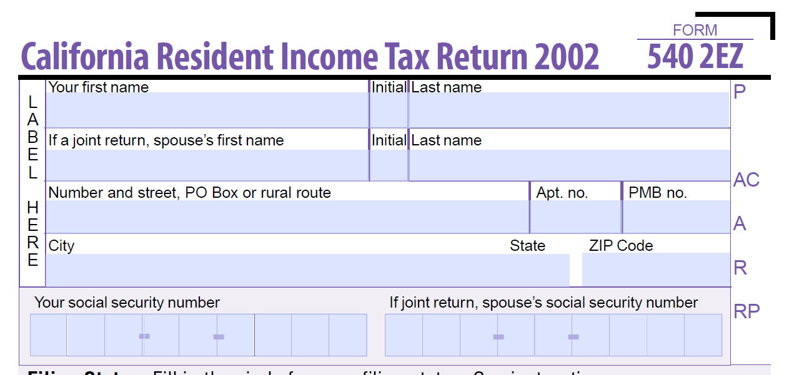

# Práticas recomendadas e padrões complexos conhecidos {#Best-practices-and-considerations2}

Este documento fornece diretrizes e recomendações das quais os administradores de formulários, autores e desenvolvedores podem se beneficiar ao trabalhar com a [!DNL Automated Forms Conversion service]. Ele discute as práticas recomendadas desde a preparação de formulários de origem até a correção de padrões complexos que exigem algum esforço extra para a conversão automática. Essas práticas recomendadas contribuem coletivamente para o desempenho e os resultados [!DNL Automated Forms Conversion service].

## Práticas recomendadas

O serviço de conversão converte PDF forms disponíveis em seu AEM [!DNL Forms] instância para formulários adaptáveis. As práticas recomendadas listadas abaixo ajudam a melhorar a velocidade e a precisão da conversão. Além disso, essas práticas recomendadas ajudam a economizar tempo gasto nas atividades de conversão do.

### Antes de fazer upload da origem

É possível fazer upload de todos os PDF forms de uma só vez ou em fases, conforme necessário. Antes de carregar os formulários, considere o seguinte:

* Mantenha o número de formulários em uma pasta menor que 15 e o número total de páginas em uma pasta menor que 50.
* Mantenha o tamanho da pasta inferior a 10 MB. Não conserve formulários em uma subpasta.
* Mantenha o número de páginas em um formulário menor que 15.
* Organize documentos de origem em um lote de 8 a 15 documentos. Mantenha formulários de origem com fragmentos de formulário adaptáveis comuns em um único lote.
* Não carregue os formulários protegidos. O serviço não converte formulários protegidos por senha e protegidos.
* Não carregue o [Portfolio PDF](https://helpx.adobe.com/br/acrobat/using/overview-pdf-portfolios.html). O serviço não converte um Portfolio de PDF em um formulário adaptável.
* Não carregue formulários de origem com espaços no nome do arquivo. Remova o espaço do nome do arquivo antes de carregar os formulários.
* Não carregue formulários digitalizados, preenchidos e em nenhum idioma além de inglês, francês, alemão, espanhol, italiano e português. Tais formas não são suportados.

Quando você usar um formulário XDP para conversão, execute as seguintes etapas antes de carregar os formulários XPD de origem:

* Analise o formulário XDP e corrija problemas visuais. Certifique-se de que o documento de origem use os controles e as estruturas desejadas. Por exemplo, o formulário de origem pode ter caixas de seleção em vez de botões de opção para uma única seleção. Altere as caixas de seleção para botões de opção a fim de produzir um formulário adaptável com os componentes desejados.
* [Adicionar associações ao formulário XDP](http://www.adobe.com/go/learn_aemforms_designer_65) antes de iniciar a conversão. Quando as associações estão disponíveis no formulário XDP de origem, o serviço aplica associações automaticamente aos campos de formulário adaptáveis correspondentes durante a conversão. Isso economiza o tempo necessário para aplicar manualmente as vinculações.
* [Adicionar tags do Adobe Sign](https://helpx.adobe.com/sign/using/text-tag.html) ao arquivo XDP. O serviço converte automaticamente tags Adobe Sign em campos de formulário adaptáveis correspondentes. O Forms adaptável é compatível com um número limitado de campos do Adobe Sign. Para obter a lista completa dos campos compatíveis, consulte [Uso do Adobe Sign em um formulário adaptável](https://experienceleague.adobe.com/docs/experience-manager-65/forms/adaptive-forms-advanced-authoring/working-with-adobe-sign.html?lang=en) documentação.
* Converter tabelas complexas em documentos XDP em tabelas simples, se possível. Uma tabela com campos de formulário em células de tabela, células de tamanho desigual, células estendidas de linha ou coluna, células mescladas, bordas parciais ou nenhuma borda visível é considerada uma tabela complexa. Uma tabela com qualquer um dos itens mencionados acima é considerada uma tabela complexa.
<!-- * Use sub-forms in XDP documents to create panels in adaptive forms. Service converts each sub-form to one or more adaptive form panels during conversion. -->

### Antes de iniciar a conversão

* Criar modelos de formulário adaptáveis. Os modelos ajudam a especificar uma estrutura uniforme para os formulários de sua organização ou departamento.
* Especifique o cabeçalho e o rodapé nos modelos de formulário adaptáveis. O serviço ignora o cabeçalho-rodapé dos documentos de origem e usa o cabeçalho-rodapé especificado no modelo de formulário adaptável.
* Crie temas de formulário adaptáveis. Os temas ajudam a fornecer uma aparência uniforme para formulários de sua organização ou departamento.
* Configure o Modelo de dados do formulário para salvar e recuperar de uma fonte de dados. Crie e configure serviços de leitura e gravação para o Modelo de dados do formulário.
* Crie fragmentos de formulário adaptáveis e configure o serviço para usar os fragmentos de formulário adaptáveis.
* Prepare modelos comuns de fluxo de trabalho para os formulários que exigem automação de processos de negócios.
* Configurar o Adobe Analytics, se necessário

## Conhecer padrões complexos

AEM [!DNL Forms Automated Conversion service] O usa inteligência artificial e algoritmos de aprendizado de máquina para entender o layout e os campos do formulário de origem. Cada serviço de aprendizado de máquina aprende continuamente com os dados de origem e produz uma saída aprimorada com cada churn. Esses serviços aprendem com experiências como as humanas.

[!DNL Automated Forms Conversion service] O é treinado em um grande conjunto de formulários. Ele identifica facilmente os campos em um formulário de origem e produz formulários adaptáveis. No entanto, existem alguns campos e estilos em PDF forms que são facilmente visíveis para o olho humano, mas difíceis de entender para o serviço. O serviço pode atribuir tipos de campo ou painéis diferentes dos aplicáveis a alguns campos ou estilos. Todos esses padrões de campo e estilo estão listados abaixo.

O serviço começaria a identificar e atribuir campos ou painéis corretos a esses padrões, à medida que continua aprendendo com os dados de origem. Por enquanto, você pode usar [Revisar e corrigir](review-correct-ui-edited.md) editor para corrigir esses problemas. Antes de começar a corrigir os problemas ou ler mais, familiarize-se com [componentes de formulário adaptáveis](https://helpx.adobe.com/experience-manager/6-5/forms/using/introduction-forms-authoring.html).

### Padrões gerais {#general}

| Padrão | Exemplo |
|--- |--- |
| **Padrão**  O serviço não converte PDF forms preenchidos em um formulário adaptável.   **Resolução**  Use formulários adaptáveis vazios. |  |
| **Padrão**  O serviço pode falhar ao reconhecer texto e campos em um formato denso.   **Resolução**   Aumente a largura entre o texto e os campos de um formulário denso antes de iniciar a conversão. |  |
| **Padrão**  O serviço não oferece suporte a formulários digitalizados.   **Resolução**  Não use formulários digitalizados. |  |
| **Padrão**  O serviço não extrai imagens e texto dentro de imagens.   **Resolução**   Adicionar imagens ou texto manualmente a formulários convertidos. |  |
| **Padrão**  Tabelas com limites pontilhados ou não claros e bordas não são convertidas.   **Resolução**  Use tabelas com bordas e limites explícitos e claros. compatível. |  |
| **Padrão**   Os formulários adaptáveis não aceitam texto vertical pronto para uso. Portanto, o serviço não converte texto vertical em texto Forms adaptável correspondente.   **Resolução**   Use o editor de formulários adaptáveis para adicionar texto vertical, se necessário. |  |

### Grupo de escolha  {#choice-group}

| Padrão | Resolução |
|--- |--- |
| **Padrão**   As opções de grupo de opções com formas diferentes de caixa ou círculo não são convertidas em componentes de formulário adaptáveis correspondentes.   **Resolução**   Altere as formas de opções de escolha para caixa ou círculo ou use o editor Revisar e Corrigir para identificar as formas. |  |

### Campos de formulário {#form-fields}

| Padrão | Resolução |
|--- |--- |
| **Padrão**   O serviço não identifica campos sem bordas claras.   **Resolução**   Use o editor de Revisar e corrigir para identificar esses campos. |  |
| **Padrão**   O serviço pode não identificar alguns campos de formulário do grupo de opções com legendas na parte inferior ou direita de um formulário.   **Resolução**   Use o editor de revisão e correção para identificar esses campos |  |
| **Padrão**   O serviço se mescla ou atribui um tipo incorreto a alguns campos de formulário que são colocados muito próximos um do outro ou não têm bordas claras.   **Resolução**   Use o editor de Revisar e corrigir para identificar esses campos. |  |
| **Padrão**   O serviço pode falhar ao reconhecer campos com legendas distantes ou uma linha pontilhada entre a legenda e o campo de entrada.   **Resolução**   Use campos de formulários com limites claros ou use o editor de Revisar e corrigir para corrigir esses problemas. |  |

### Listas {#lists}

| Padrão | Resolução |
|--- |--- |
| **Padrão**  As listas que contêm campos de formulário são mescladas ou não são convertidas em componentes de formulário adaptáveis correspondentes   **Resolução**  Use campos de formulários com limites claros ou use o editor de Revisar e corrigir para corrigir esses problemas. |  |
| **Padrão**  O serviço pode deixar algumas listas aninhadas não identificadas   **Resolução**   Use o editor de Revisar e corrigir para corrigir esses problemas. |  |
| **Padrão**   O serviço mescla algumas listas contendo grupos de opções entre si   **Resolução**   Use o editor de Revisar e corrigir para corrigir esses problemas. |  |

<!--
Comment Type: draft

<h3>Choice groups</h3>
-->

<!--
Comment Type: draft

<ul>
<li>Lists with form fields, nested lists, and nested choice groups are not supported.</li>
<li>Form fields with captions at bottom or right are not supported.</li>
<li>Form fields without borders are not supported.</li>
<li>Hidden form fields are not supported.</li>
<li>Button in PDF forms are not converted to adaptive form buttons.  </li>
<li>Tables with clear explicit boundaries and borders are supported.</li>
<li>Fields with far away captions are not supported.  </li>
<li>Choice groups with only box or circle shaped selectors are supported. </li>
</ul>
-->
