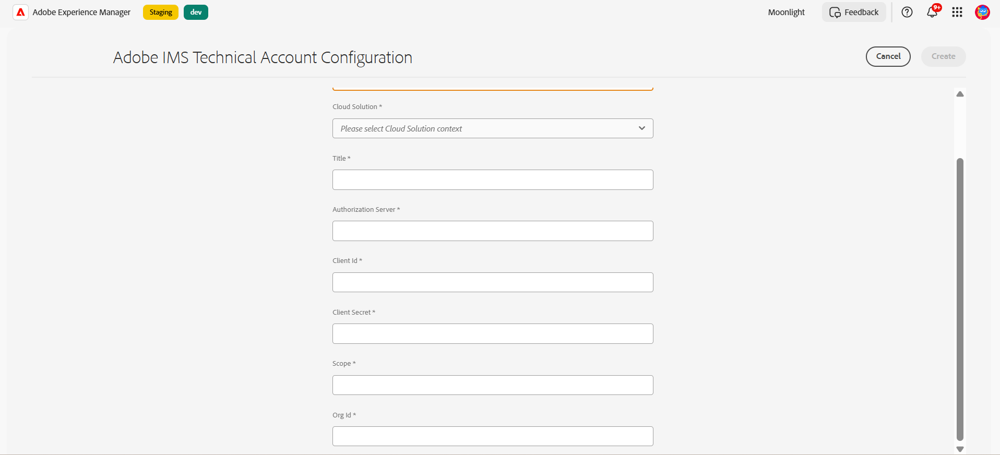

# Configurar o serviço de conversão automática de formulários (AFCS) {#about-this-help}

Este artigo descreve como um administrador do AEM pode configurar o Serviço de conversão automática de formulários (AFCS) para automatizar a conversão do PDF forms no Adaptive Forms. Este artigo é para administradores de TI e da AEM em sua organização. As informações fornecidas baseiam-se na premissa de que qualquer pessoa que leia este artigo está familiarizada com as seguintes tecnologias:

* Instalação, configuração e administração de pacotes do Adobe Experience Manager e AEM,

* Usando os sistemas operacionais Linux® e Microsoft® Windows®,

<!--- >[!VIDEO](https://video.tv.adobe.com/v/29267/) 

**Watch the video or read the article to configure Automated Forms Conversion service (AFCS)** -->

## Integração{#onboarding}

O serviço está disponível gratuitamente para clientes de vigência no local do AEM 6.5 Forms e clientes corporativos do Adobe Managed Service. Você pode entrar em contato com a equipe de vendas da Adobe ou com seu representante da Adobe para solicitar acesso ao serviço. O serviço também está disponível gratuitamente e pré-ativado para clientes do AEM Forms as a Cloud Service.

A Adobe habilita o acesso para sua organização e fornece os privilégios necessários à pessoa designada como administrador em sua organização. O administrador pode conceder acesso aos desenvolvedores (usuários) do AEM Forms de sua organização para se conectar ao serviço.

## Pré-requisitos {#prerequisites}

Você precisa do seguinte para usar o Serviço de conversão automática de formulários (AFCS):

* O serviço de conversão automática de formulários (AFCS) está ativado para sua organização
* Uma conta do Adobe ID com privilégios de administrador para o serviço de conversão
* Uma instância de autor ativa e em execução do AEM 6.5 com o AEM Service Pack ou AEM Forms as a Cloud Service mais recente com as atualizações mais recentes.
* Um usuário do AEM (em sua instância do AEM) que é membro do grupo de usuários de formulários

## Configurar o ambiente {#setuptheservice}

Antes de usar o serviço, prepare sua instância do autor do AEM para se conectar ao serviço em execução na Adobe Cloud. Execute as seguintes etapas na sequência listada para preparar sua instância para o serviço:

1. [Baixe e instale o AEM 6.5 ou o AEM Forms as a Cloud Service integrado](#aemquickstart)
1. [(Somente para o AEM 6.5) Baixe e instale o Service Pack mais recente da AEM](#servicepack)
1. [(Somente para o AEM 6.5) Baixe e instale o pacote complementar mais recente do AEM Forms](#downloadaemformsaddon)
1. [Criar temas e modelos personalizados](#referencepackage)

### 1. Baixe e instale o AEM 6.5 ou o AEM Forms as a Cloud Service integrado {#aemquickstart}


O serviço de conversão automática de formulários (AFCS) é executado na instância de autor do AEM. Você precisa do AEM 6.5 ou AEM Forms as a Cloud Service para configurar uma instância de autor do AEM.

* Se você não tiver o AEM 6.5 em execução, baixe-o dos locais abaixo. Depois de baixar o AEM, para obter instruções sobre como configurar uma instância de autor do AEM, consulte [implantação e manutenção](https://helpx.adobe.com/br/experience-manager/6-5/sites/deploying/using/deploy.html#defaultlocalinstall).:

   * Se você for um cliente atual do AEM, baixe o AEM 6.5 do [site de Licenciamento da Adobe](http://licensing.adobe.com).

   * Se você for um parceiro da Adobe, use o [Programa de Treinamento para Parceiros da Adobe](https://adobe.allegiancetech.com/cgi-bin/qwebcorporate.dll?idx=82357Q) para solicitar o AEM 6.5.

* Se você estiver usando o AEM Forms as a Cloud Service, consulte integrar o [AEM Forms as a Cloud Service](https://experienceleague.adobe.com/docs/experience-manager-forms-cloud-service/forms/setup-environment/setup-forms-cloud-service.html?lang=pt-BR#setup-environment) e [configurar um ambiente de desenvolvimento local](https://experienceleague.adobe.com/docs/experience-manager-forms-cloud-service/forms/setup-environment/setup-local-development-environment.html?lang=pt-BR#setup-environment).

### 2. (Somente para o AEM 6.5) Baixar e instalar o AEM com o Service Pack mais recente {#servicepack}

Baixe e instale o AEM Service Pack mais recente. Para obter instruções detalhadas, consulte as [Notas de versão do Service Pack do AEM 6.5](https://experienceleague.adobe.com/pt-br/docs/experience-manager-65/content/release-notes/release-notes).

### 3. (Somente para o AEM 6.5) Baixar e instalar o pacote complementar do AEM Forms  {#downloadaemformsaddon}

Uma instância do AEM contém recursos básicos de formulários. O serviço de conversão exige todos os recursos do AEM Forms. Baixe e instale o pacote complementar do AEM Forms para aproveitar todos os recursos do AEM Forms. O pacote é necessário para configurar e executar o serviço de conversão. Para obter instruções detalhadas, consulte [Instalar e configurar recursos de captura de dados.](https://experienceleague.adobe.com/pt-br/docs/experience-manager-65/content/forms/install-aem-forms/osgi-installation/installing-configuring-aem-forms-osgi)
https://adminconsole.adobe.com/
>[!NOTE]
> Execute as configurações obrigatórias após a instalação do pacote complementar.
>

<!-- ### (Optional) Download and install connector package  {#installConnectorPackage}

The connector package provides early access to the [Auto-detect logical sections](convert-existing-forms-to-adaptive-forms.md#run-the-conversion) features and improvements delivered in release AFC-2020.03.1. Do not install the package if you do not require feature and improvements delivered in AFC-2020.03.1.  You can [download the connector package from AEM Package Share](https://www.adobeaemcloud.com/content/marketplace/marketplaceProxy.html?packagePath=/content/companies/public/adobe/packages/cq650/featurepack/AFCS-Connector-2020.03.1). -->


### 4. Criar temas e modelos personalizados {#referencepackage}

Os pacotes de referência contêm exemplos de temas e modelos. O serviço de conversão automática de formulários (AFCS) requer pelo menos um tema e um modelo para converter um formulário do PDF em um formulário adaptável. Crie um tema e um modelo personalizados próprios e aponte a [configuração de serviço](#configure-the-cloud-service) para usar modelos e temas personalizados antes de usar o serviço.

Você também pode baixar e instalar o pacote [AEM Forms Reference Assets](https://experience.adobe.com/#/downloads/content/software-distribution/en/aemcloud.html) na sua instância de Autor. Ele cria alguns temas de referência e template.

## Configurar acesso e permissões

Antes de continuar a configurar o serviço e conectar sua instância ao serviço em execução na Adobe Cloud, saiba mais sobre as personas e os privilégios necessários para se conectar ao serviço. O serviço usa dois tipos diferentes de personas, administradores e desenvolvedores:

* **Administradores**: os administradores são responsáveis pelo gerenciamento de software e serviços da Adobe para sua organização. Os administradores concedem acesso aos desenvolvedores em sua organização para se conectarem ao Serviço de conversão automática de formulários (AFCS) em execução na Adobe Cloud. Quando um administrador é provisionado para uma organização, o administrador recebe um email com o título **[!UICONTROL 'You now have administrator rights to manage Adobe software and services for your organization']**. Se você for um administrador, verifique se há emails na sua caixa de correio com o título mencionado anteriormente e prossiga para [conceder acesso aos desenvolvedores da sua organização](#adduseranddevs).


* **Desenvolvedores**: um desenvolvedor conecta uma instância de autor do AEM Forms ao serviço de conversão automática de formulários (AFCS) em execução na Adobe Cloud. Quando um administrador concede direitos a um desenvolvedor para se conectar ao Serviço de conversão automática de formulários (AFCS), um email com o título Você agora tem acesso de desenvolvedor para gerenciar integrações de API do Adobe para sua organização é enviado ao desenvolvedor. Se você for um desenvolvedor, verifique se há emails em sua caixa de correio com o título mencionado anteriormente e prossiga para [Conecte sua instância do AEM local ao serviço de Conversão Automatizada de Formulários na Adobe Cloud.](#connectafcadobeio)


### Conceder acesso aos desenvolvedores de sua organização

Depois que a Adobe habilitar o acesso para sua organização e fornecer os privilégios necessários ao administrador, ele poderá fazer logon no Admin Console (instruções detalhadas abaixo), criar um perfil e adicionar desenvolvedores ao perfil. Os desenvolvedores podem conectar uma instância do AEM Forms ao serviço de conversão automática de formulários (AFCS) na Adobe Cloud.

Desenvolvedores são membros de sua organização designados para executar o serviço de conversão. Somente os desenvolvedores adicionados ao perfil do serviço de conversão automática de formulários (AFCS) do Adobe têm direito a usar o serviço de conversão automática de formulários (AFCS).
Execute as etapas abaixo para criar um perfil e adicionar desenvolvedores a ele. É necessário pelo menos um perfil para conceder o acesso necessário aos desenvolvedores de sua organização:

1. Faça logon no [Admin Console](https://adminconsole.adobe.com/). Use o **Adobe ID** do administrador provisionado para usar o serviço de conversão automática de formulários (AFCS) para fazer logon.
1. Clique na opção **[!UICONTROL Automated Forms Conversion]**.
1. Clique em **[!UICONTROL New Profile]** na guia **[!UICONTROL Products]**.
1. Especifique **[!UICONTROL Name]**, **[!UICONTROL Display Name]** e **[!UICONTROL Description]** para o perfil. Clique em **[!UICONTROL Done]**. Por exemplo, crie um perfil como **AFC_Flamingo_Test_Dev**.

   

1. Adicionar desenvolvedor ao perfil. Para adicionar os desenvolvedores:
   1. Na [Admin Console](https://adminconsole.adobe.com/enterprise), navegue até a guia Visão Geral.
   1. Clique em **[!UICONTROL Assign Developers]** no cartão de produto necessário.
   1. Insira o endereço de email dos desenvolvedores e, opcionalmente, o nome e sobrenome.
   1. Selecione perfis de produto. Clique em **[!UICONTROL Save]**.

Repita as etapas acima para todos os usuários. Para obter mais detalhes sobre como adicionar desenvolvedores, consulte [Gerenciar desenvolvedores](https://helpx.adobe.com/br/enterprise/using/manage-developers.html).

Depois que um administrador adiciona desenvolvedores ao perfil do Adobe I/O, eles são notificados por email (se configurado).

<!--
### Configure email notification for local AEM Forms instance

Automated Forms Conversion service (AFCS) uses the Day CQ mail service to send email notifications. These email notifications contain information about successful or failed conversions. If you choose not receive notification, skip these steps. Perform the following steps to configure the Day CQ Mail Service:

* **For AEM 6.5 Forms**:

   1. Go to AEM configuration manager at `http://[server]:[port]/system/console/configMgr`
   2. Open the Day CQ Mail Service configuration. Specify a value for the **[!UICONTROL SMTP server host name]**, **[!UICONTROL SMTP server port]**, and **[!UICONTROL From address]** fields. Click **[!UICONTROL Save]**.

      You can contact your email service provider or IT administrator for information about host name and port of SMTP server. You can use any valid email address in the from field. For example, notification@example.com or donotreply@example.com.

   3. Open the **[!UICONTROL Day CQ Link Externalizer]** configuration. In the **[!UICONTROL Domains]** field, specify the actual host name or IP address and port number for local, author, and publish instances. Click **[!UICONTROL Save]**.

* For AEM Forms as a Cloud Service, [log a support ticket to enable the email service](https://experienceleague.adobe.com/docs/experience-manager-cloud-service/implementing/developing/development-guidelines.html?lang=pt-BR#sending-email). -->

### Adicionar usuário ao grupo de formulários-usuários {#adduserstousergroup}

Especifique um endereço de email no perfil do usuário do AEM designado para executar o serviço. Certifique-se de que o usuário é membro do grupo **forms-users**. Os emails são enviados para o endereço de email do usuário que está executando a conversão. Para especificar um endereço de email para o usuário e adicionar o usuário ao grupo de usuários de formulários:

1. Faça logon na instância de autor do AEM Forms como administrador do AEM. Use suas credenciais locais do AEM para fazer logon.
1. Clique em **[!UICONTROL Adobe Experience Manager]** > **[!UICONTROL Tools]** > **[!UICONTROL Security]** > **[!UICONTROL Users]**.
1. Selecione um usuário designado para executar o serviço de conversão e clique em **[!UICONTROL Properties]**. A página **Editar configurações do usuário** é aberta.
1. Especifique um endereço de email no campo **[!UICONTROL Email]** e clique em **[!UICONTROL Save]**. Os emails são enviados para o endereço de email especificado após a conclusão bem-sucedida ou a falha da conversão.

   
1. Clique na guia **Grupos**. Na guia Selecionar grupo, digite e selecione o grupo **formulários-usuários**.
1. Clique em **Salvar e fechar**. O usuário agora é membro do grupo de formulários-usuários.

   

## Conecte sua instância do AEM Forms ao Serviço de conversão automática de formulários (AFCS) na Adobe Cloud

Depois que um administrador fornecer acesso de desenvolvedor, você poderá conectar sua instância do AEM Forms ao AFCS (Serviço de conversão automatizada de formulários) em execução na Adobe Cloud.
Execute as seguintes etapas para conectar a instância do AEM Forms ao serviço de Conversão automática de formulários:

[1. Configurar as APIs de serviço no Adobe Developer Console](#configure-the-service-apis-on-adobe-developer-console)

[2. Criar configurações do Adobe IMS](#2-create-adobe-ims-configurations)

[3. Criar configuração de conversão automática de formulários](#3-create-automated-forms-conversion-configuration)

### 1. Configurar as APIs de serviço no Adobe Developer Console

Para usar o AFCS (Serviço de Conversão Automatizada de Formulários), crie um projeto e adicione a API do **Serviço de Configuração Automatizada do Forms** ao projeto no Adobe Developer Console. A integração gera a chave da API, o segredo do cliente, a ID de conta técnica, os escopos e a ID da organização.
Para configurar a API do serviço de conversão automática de formulários no Adobe Developer Console, execute as seguintes etapas:

1. Faça logon em https://developer.adobe.com/console . Use sua conta de desenvolvedor do Adobe ID provisionada pelo administrador para fazer logon no console do Adobe I/O para fazer logon.
1. Selecione sua organização no canto superior direito. Se não souber sua organização, entre em contato com o administrador.
1. Clique em **[!UICONTROL Create new project]**. Uma tela para começar a usar o novo projeto é exibida.

   

1. Clique em **[!UICONTROL Add API]**. Uma tela com a lista de todas as APIs ativadas para sua conta é exibida.
   

1. Selecione **[!UICONTROL Automated Forms Conversion service]** e clique em **[!UICONTROL Next]**. Uma tela para configurar a API é exibida.
   

1. Selecione o método de autenticação **OAuth de servidor para servidor**.
1. Especifique o **[!UICONTROL Credential Name]** e clique em **[!UICONTROL Next]**.
   
1. Selecione um **Perfil de Produto**. Por exemplo, selecione um perfil como **AFC_Flamingo_Test_Dev**.
1. Clique em **[!UICONTROL Save configured API]**.
   

   >[!NOTE]
   >
   > Selecione o perfil criado ao conceder acesso aos desenvolvedores de sua organização. Caso não saiba o perfil a ser selecionado, entre em contato com o administrador.

1. Clique em **[!UICONTROL OAuth Server-to-Server]** para exibir a Chave da API, o Segredo do Cliente e outras informações necessárias para conectar sua instância do AEM ao AFCS (Serviço de Conversão Automatizada de Formulários).
   

   As informações na página são usadas para criar a configuração IMS, conforme explicado na seção [Criar configuração técnica IMS na instância de autor do AEM](#2-create-ims-technical-configuration-on-aem-author-instance).

   

### 2. Criar configurações do Adobe IMS

Faça logon na instância do autor para criar as configurações do Adobe IMS. Use os **Detalhes das Credenciais do OAuth** para recuperar a Chave da API, o Segredo do Cliente, a ID da Conta Técnica, os Escopos e a ID da Organização.

1. Faça logon na instância de autor do AEM Forms. Navegue até **[!UICONTROL Tools]**> **[!UICONTROL Security]** > **[!UICONTROL Adobe IMS Configurations]**.
1. Clique em **[!UICONTROL Create]**.

   

1. A página **[!UICONTROL Adobe IMS Technical Account Configuration]** é exibida.

   
1. Selecione **[!UICONTROL Automated Forms Conversion Service]** em **Solução da Nuvem**.
1. Especifique os seguintes:

   * **Título**: especifique um título.
   * **Servidor de Autorização**: [https://ims-na1.adobelogin.com](https://ims-na1.adobelogin.com)
   * Recupere o seguinte da seção [Configurar as APIs de serviço no Adobe Developer Console](#1-configure-the-service-apis-on-adobe-developer-console):
      * **ID do Cliente**: Copiar e colar **Chave de API(ID do Cliente)**.
      * **Segredo do Cliente**: Copiar e colar **Segredo do Cliente**.
      * **Escopo**: copiar e colar **Escopos**.
      * **ID da Organização**: copiar e colar **ID da Conta Técnica**.

     

1. Clique em **[!UICONTROL Save]**. A configuração do Adobe IMS é criada.

   >[!CAUTION]
   >
   > Crie apenas uma configuração IMS. Não crie mais de uma configuração IMS.

1. Selecione a **Configuração do Adobe IMS** e clique em **[!UICONTROL Check Health]**. Uma caixa de diálogo é exibida.
   

   Uma caixa de diálogo **Verificar** é exibida.

1. Clique em **[!UICONTROL Check]**.

   

   Ao se conectar com êxito, a mensagem *Token recuperado com êxito* é exibida.

   

1. Clique em **Fechar**.

### 3. Criar configuração de conversão automática de formulários

Crie uma configuração de Conversão automática de formulários para conectar sua instância do AEM ao serviço de conversão. Também permite especificar um modelo, tema e fragmentos de formulário para uma conversão. Você pode criar várias configurações do Cloud Service separadas para cada conjunto de formulários.
Por exemplo, você pode ter uma configuração separada para formulários do departamento de vendas e outra separada para formulários de suporte ao cliente. Execute as seguintes etapas para criar uma configuração do Cloud Service:

1. Na sua instância do AEM Forms, clique em **[!UICONTROL Adobe Experience Manager]** > **[!UICONTROL Tools]**> **[!UICONTROL Cloud Services]** > **[!UICONTROL Automate Forms Conversion Configuration]**.
1. Selecione a pasta **[!UICONTROL Global]** e clique em **[!UICONTROL Create]**.
A página para **Criar configuração de conversão automática de formulários** é exibida. A configuração é criada na pasta **Global**. Você também pode criar a configuração em uma pasta diferente que exista ou criar uma pasta para suas configurações.
   
1. Na página **[!UICONTROL Create Automated Forms Conversion Configuration]**, especifique o valor para os campos a seguir e clique em **[!UICONTROL Next]**.

   

   | Texto | Descrição |
   |--- |--- |
   | Título | Título exclusivo da configuração. O título é exibido na interface usada para iniciar a conversão. |
   | Nome | Nome exclusivo da configuração. A configuração é salva no CRX-Repository com o nome especificado. O nome pode ser idêntico ao título. |
   | Local da miniatura | Local da miniatura da configuração. |
   | URL do serviço | URL do serviço de conversão automática de formulários (AFCS) na Adobe Cloud. Use a URL `https://aemformsconversion.adobe.io/`. |
   | Modelo | Modelo padrão a ser aplicado aos formulários convertidos. Você sempre pode especificar um modelo diferente antes de iniciar a conversão. Um modelo contém a estrutura básica e o conteúdo inicial de um formulário adaptável. Você pode escolher um modelo entre os modelos fornecidos prontos para uso. Você também pode criar um modelo personalizado. |
   | Tema | Tema padrão a ser aplicado aos formulários convertidos. Você sempre pode especificar um tema diferente antes de iniciar a conversão.  Você pode clicar no ícone para escolher um tema fornecido imediatamente. Você também pode criar um tema personalizado. |
   | Fragmentos existentes | Local dos fragmentos existentes, se houver. |
   | Modelo meta personalizado | Caminho do arquivo .schema.json do modelo meta personalizado. É possível criar metamodelos separados para inglês, francês, alemão, espanhol, italiano e português. |

1. Na guia **[!UICONTROL Advanced]** da página **[!UICONTROL Create Automated Forms Conversion Configuration]**, especifique o valor para o seguinte campo:
   

   <table>
   <thead>
   <tr>
   <th>Texto</th>
   <th>Descrição</th>
   </tr>
   </thead>
   <tbody>
   <tr>
   <td >Gerar documento de registro</td>
   <td>Selecione a opção para gerar automaticamente o Documento de registro para formulários convertidos. A opção é somente para formulários baseados em XFA (XDP e PDF forms). Ao ativar a opção, após enviar um formulário, você pode permitir que seus clientes mantenham um registro, em formato impresso ou de documento, das informações que preencheram no formulário para referência futura. Isso é chamado de documento de registro.</td>
   </tr>
   <tr>
   <td>Habilitar Analytics</td>
   <td>(Para o AEM 6.5) Selecione a opção para ativar o Adobe Analytics em todos os formulários convertidos. Antes de usar a opção, verifique se o Adobe Analytics está ativado para a sua instância do AEM Forms.</td>
   </tr>
   </tbody>
   </table>

   * Quando a origem é um formulário baseado em XFA com extensão .XDP, o DOR de saída retém o layout XFA ou o serviço de conversão usa um modelo pronto para uso para gerar DOR para outros formulários baseados em XFA.
   * Quando um formulário XFA é enviado, os dados de envio do formulário são salvos como um elemento XML ou um atributo. Por exemplo, `<Amount currency="USD"> 10.00 </Amount>`. A moeda é salva como um atributo e a quantia da moeda, 10,00 é salva como um elemento. Os dados enviados de um formulário adaptável não têm atributos, têm apenas elementos. Assim, quando um formulário baseado em XFA é convertido em um formulário adaptável, os dados de envio do formulário adaptável contêm um elemento para cada atributo. Por exemplo,

   ```css
      {
         "Type": "Principal",
   
         "Amount": "10.00",
   
         "currency": "USD"
      }
   ```

1. Clique em **[!UICONTROL Create]**. A configuração da nuvem é criada. Sua instância do AEM Forms está pronta para começar a converter formulários herdados em Forms adaptável.
