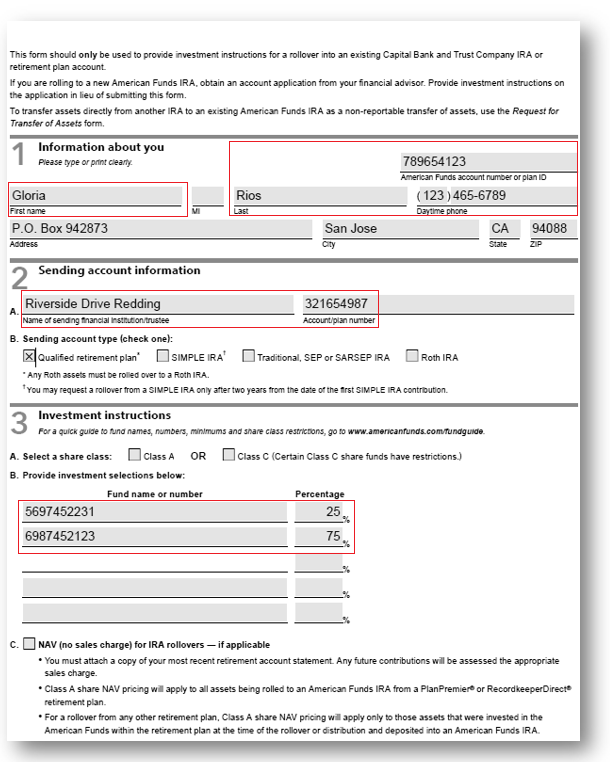
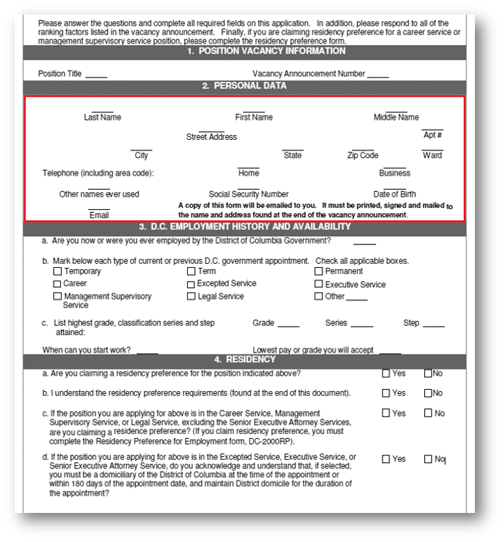
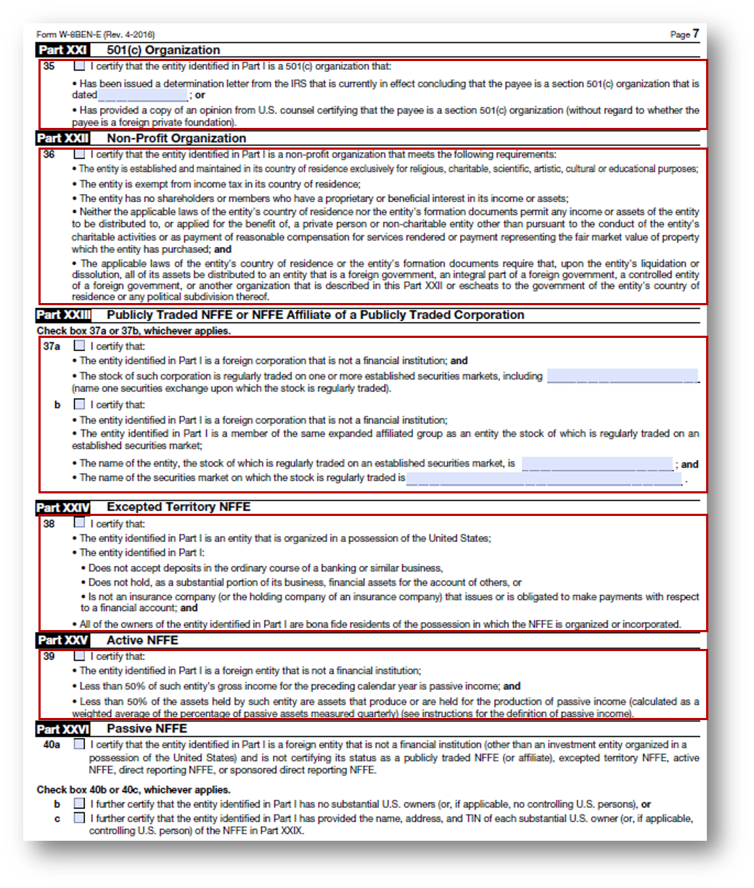

# Práticas recomendadas e considerações {#do-not-publish-best-practices-and-considerations}

<!--
[DO NOT PUBLISH]
-->

O serviço de conversão automatizada do AEM Forms converte um formulário de PDF em um formulário adaptável. O serviço usa inteligência artificial e algoritmos de aprendizado de máquina para entender o layout e os campos do formulário de origem. Cada serviço de aprendizado de máquina aprende continuamente com os dados de origem e produz uma saída aprimorada com cada churn. Esses serviços aprendem com a experiência, como os seres humanos.

O serviço de automated forms conversion (AFCS) é treinado em um grande conjunto de formulários. Ele identifica facilmente os campos em um formulário de origem e produz formulários adaptáveis. No entanto, existem alguns campos e estilos em PDF forms que são facilmente visíveis para o olho humano, mas difíceis de entender para o serviço. O serviço pode atribuir tipos de campos ou painéis diferentes dos aplicáveis a alguns campos ou estilos. Todos esses padrões de campo e estilo estão listados abaixo.

O serviço começaria a identificar e atribuir campos ou painéis corretos a esses padrões, à medida que continua aprendendo com os dados de origem. Por enquanto, você pode usar o editor de [Revisar e corrigir](review-correct-ui-edited.md) para corrigir esses problemas. Antes de começar a corrigir os problemas ou ler mais, familiarize-se com [componentes de formulário adaptáveis](https://helpx.adobe.com/experience-manager/6-5/forms/using/introduction-forms-authoring.html).

## Geral {#general}

<table border="1" cellpadding="1" cellspacing="0" style="border-collapse: separate; border-spacing: 0px;" width="100%"> 
 <tbody>
  <tr>
   <td width="30%">Padrões e resolução conhecidos</td> 
   <td width="70%">Exemplo</td> 
  </tr>
   <td>
<strong>Padrão</strong>
 
O serviço não converte PDF forms preenchidos em formulário adaptável.
 
 
 
<strong>Resolução</strong>
 
Use formulários adaptáveis vazios.
 </td> 
   <td style="text-align: left;"></td> 
  </tr>
  <tr>
   <td>
<strong>Padrão</strong>
 
O serviço pode falhar ao reconhecer texto e campos em um formato denso.
 
 
 
<strong>Resolução</strong>
 
Aumente a largura entre o texto e os campos de um formulário denso antes de iniciar a conversão.
 </td> 
   <td style="text-align: left;"></td> 
  </tr>
  <tr>
   <td>
<strong>Padrão</strong>
 
O serviço não oferece suporte a formulários digitalizados.
 
 
 
<strong>Resolução</strong>
 
Não use formulários digitalizados. 
 </td> 
   <td></td> 
  </tr>
  <tr>
   <td>
<strong>Padrão</strong>
 
O serviço não extrai imagens e texto dentro de imagens. 
 
 
 
<strong>Resolução</strong>
 
Adicionar imagens ou texto manualmente a formulários convertidos.
 </td> 
   <td></td> 
  </tr>
  <tr>
   <td>
<strong>Padrão</strong>
 
Tabelas com limites pontilhados ou não claros e bordas não são convertidas.
 
<strong>Resolução</strong>
 
Use tabelas com bordas e limites explícitos e claros. compatível.
 </td> 
   <td></td> 
  </tr>
 </tbody>
</table>

## Grupo de escolha  {#choice-group}

<table border="1" cellpadding="1" cellspacing="0" width="100%"> 
 <tbody>
  <tr>
   <td width="30%">Padrão</td> 
   <td width="70%">Exemplo</td> 
  </tr>
  <tr>
   <td>
<strong>Padrão</strong>
 
As opções de grupo de opções com formas diferentes de caixa ou círculo não são convertidas em componentes de formulário adaptáveis correspondentes. 
 
 
 
<strong>Resolução</strong>
 
Altere as formas de opções de escolha para caixa ou círculo ou use o editor Revisar e Corrigir para identificar as formas.
 </td> 
   <td> </td> 
  </tr>
 </tbody>
</table>

## Campos de formulário {#form-fields}

<table border="1" cellpadding="1" cellspacing="0" width="100%"> 
 <tbody>
  <tr>
   <td width="30%">Padrão</td> 
   <td width="70%">Exemplo</td> 
  </tr>
  <tr>
   <td width="25%">
<strong>Padrão</strong>
 
O serviço não identifica campos sem bordas claras.
 
 
 
<strong>Resolução</strong>
 
Use o editor de Revisar e corrigir para identificar esses campos.
 
 
 
 
 </td> 
   <td width="50%">  </td> 
  </tr>
  <tr>
   <td>
<strong>Padrão</strong>
 
O serviço deixa alguns campos de formulário com legendas na parte inferior ou direita não identificadas.
 
 
 
<strong>Resolução</strong>
 
Use o editor de revisão e correção para identificar esses campos
 </td> 
   <td>    </td> 
  </tr>
  <tr>
   <td>
<strong>Padrão</strong>
 
O serviço se mescla ou atribui um tipo errado a alguns campos de formulário que são colocados muito próximos um do outro ou não têm bordas claras. 
 
 
 
<strong>Resolução</strong>
 
Use o editor de Revisar e corrigir para identificar esses campos.
 </td> 
   <td></td> 
  </tr>
  <tr>
   <td>
<strong>Padrão</strong>
 
O serviço pode falhar ao reconhecer campos com legendas distantes ou uma linha pontilhada entre a legenda e o campo de entrada.
 
 
 
<strong>Resolução</strong>
 
Use campos de formulários com limites claros ou use o editor de Revisar e corrigir para corrigir esses problemas.
 </td> 
   <td></td> 
  </tr>
 </tbody>
</table>

## Listas {#lists}

<table border="1" cellpadding="1" cellspacing="0" width="100%"> 
 <tbody>
  <tr>
   <td width="30%">Padrão</td> 
   <td width="70%">Exemplo</td> 
  </tr>
  <tr>
   <td>
<strong>Padrão</strong>
 
As listas que contêm campos de formulário são mescladas ou não são convertidas em componentes de formulário adaptáveis correspondentes
 
<strong>Resolução</strong>
 
Use campos de formulários com limites claros ou use o editor de Revisar e corrigir para corrigir esses problemas.
 </td> 
   <td></td> 
  </tr>
  <tr>
   <td>
<strong>Padrão</strong>
 
O serviço pode deixar algumas listas aninhadas não identificadas
 
 
 
<strong>Resolução</strong>
 
Use o editor de Revisar e corrigir para corrigir esses problemas.
 </td> 
   <td> </td> 
  </tr>
  <tr>
   <td>
<strong>Padrão</strong>
 
O serviço mescla algumas listas contendo grupos de opções entre si
 
<strong>Resolução</strong>
 
Use o editor de Revisar e corrigir para corrigir esses problemas.
 </td> 
   <td> </td> 
  </tr>
 </tbody>
</table>

<!--
Comment Type: draft

<h3>Choice groups</h3>
-->

<!--
Comment Type: draft

<ul>
<li>Lists with form fields, nested lists, and nested choice groups are not supported.</li>
<li>Form fields with captions at bottom or right are not supported.</li>
<li>Form fiields without bordes are not supported.</li>
<li>Hidden form fields are not supported.</li>
<li>Button in PDF forms are not converted to adaptive form buttons.  </li>
<li>Tables with clear explicit boundaries and borders are supported.</li>
<li>Fields with far away captions are not supported.  </li>
<li>Choice groups with only box or circle shaped selectors are supported. </li>
</ul>
-->

