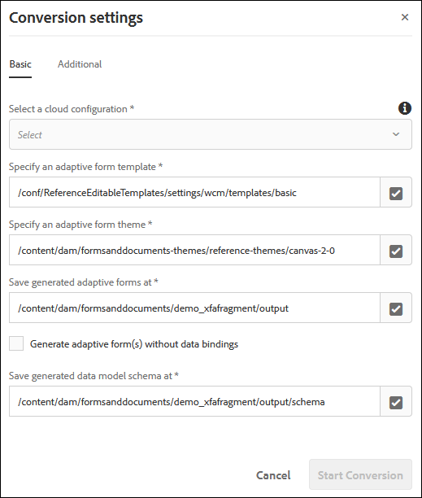

# Converter PDF forms em formulários adaptáveis {#convert-print-forms-to-adaptive-forms}

O serviço AEM Forms Automated forms conversion, desenvolvido pela Adobe Sensei, converte automaticamente seus PDF forms em formulários adaptáveis responsivos e compatíveis com dispositivos. Se você estiver usando PDF forms não interativos, Acro Forms ou PDF forms baseados em XFA, o serviço do Automated forms conversion pode converter facilmente esses formulários em formulários adaptáveis. Para obter informações sobre recursos, fluxo de trabalho de conversão e informações de integração, consulte [Automated forms conversion](introduction.md) serviço.

## Pré-requisitos {#pre-requisites}

* [**Configurar o serviço de conversão**](configure-service.md)

* **Prepare o [modelos](https://helpx.adobe.com/experience-manager/6-5/forms/using/template-editor.html) a aplicar aos formulários convertidos:** O uso de um modelo permite aplicar identidade visual consistente em todos os formulários adaptáveis. Além disso, o serviço do Automated forms conversion não extrai e usa o cabeçalho e o rodapé de documentos PDF de origem. Você pode usar modelos de formulário adaptáveis para especificar o cabeçalho e o rodapé. O cabeçalho e o rodapé especificados no modelo são aplicados ao formulário adaptável durante a conversão. Ao criar uma pasta para os modelos, selecione a variável **[!UICONTROL Browse configurations]** para todos.

* **Prepare o [temas](https://helpx.adobe.com/experience-manager/6-5/forms/using/themes.html) a aplicar aos formulários convertidos:** Usar um tema permite aplicar um estilo consistente a todas as formas adaptáveis da organização.

* **(opcional)** [**Converter seus PDF forms de origem em formulário do Adobe Sign**](frequently-asked-questions.md)

## Iniciar o processo de conversão {#start-the-conversion-process}

Depois de conectar sua instância do AEM ao Serviço de conversão do AEM Forms, você pode converter seus PDF forms em formulários adaptáveis. Execute as seguintes etapas na ordem listada para converter os formulários:

* [Fazer upload de PDF forms para o servidor do AEM Forms](convert-existing-forms-to-adaptive-forms.md#upload-pdf-forms-to-your-aem-forms-server)
* [Executar a conversão](convert-existing-forms-to-adaptive-forms.md#run-the-conversion)
* [Revisar e corrigir os formulários convertidos](review-correct-ui-edited.md)

### Fazer upload de PDF forms para o servidor do AEM Forms {#upload-pdf-forms-to-your-aem-forms-server}

O serviço de conversão converte os PDF forms disponíveis na instância do AEM Forms em formulários adaptáveis. É possível fazer upload de todos os PDF forms de uma só vez ou em fases, conforme necessário. Antes de carregar os formulários, considere o seguinte:

* Mantenha o número de formulários em uma pasta menor que 15 e o número total de páginas em uma pasta menor que 50.
* Mantenha o tamanho da pasta inferior a 10 MB. Não mantenha formulários em uma subpasta.
* Mantenha o número de páginas em um formulário menor que 15.
* Não carregue os formulários protegidos. O serviço não converte formulários protegidos por senha e protegidos.
* Não carregue formulários de origem com espaços no nome do arquivo. Remova o espaço do nome do arquivo antes de carregar os formulários.
* Não carregue [portfólios em PDF](https://helpx.adobe.com/br/acrobat/using/overview-pdf-portfolios.html). O serviço não converte um Portfolio de PDF em um formulário adaptável.
* Leia o [Problemas conhecidos](known-issues.md) e a variável [Práticas recomendadas e considerações](styles-and-pattern-considerations-and-best-practices.md) seções e faça sugestões de alterações nos formulários.

Execute as seguintes etapas para carregar os formulários a serem convertidos em uma pasta na sua instância do AEM Forms:

1. Faça logon na instância do AEM Forms.

1. Toque **[!UICONTROL Adobe Experience Manager]**  > **[!UICONTROL Navigation]**  > **[!UICONTROL Forms]** > **[!UICONTROL Forms & Documents]**.
1. Toque **[!UICONTROL Create]**> **[!UICONTROL Folder]**. Especificar **Título** e **Nome** da pasta. Toque **[!UICONTROL Create]**. Uma pasta é criada.
1. Toque para abrir a pasta recém-criada.
1. Toque **[!UICONTROL Create]**> **[!UICONTROL File Upload]**. Selecione os formulários para carregar, clique em **[!UICONTROL Open]** e clique em **[!UICONTROL Upload]**. Os formulários são carregados.

### Executar a conversão {#run-the-conversion}

Depois de carregar os formulários e configurar o serviço, execute as seguintes etapas para iniciar a conversão:

1. Na instância do AEM Forms, toque em **[!UICONTROL Adobe Experience Manager]**  > **[!UICONTROL Navigation]**  > **[!UICONTROL Forms]** > **[!UICONTROL Forms & Documents]**.
1. Selecione um formulário ou a pasta que contém PDF forms (formulários a serem convertidos) e toque em **[!UICONTROL Start Automated Conversion]**. A variável **[!UICONTROL Conversion Settings]** será exibida.

   

1. No **[!UICONTROL Basic]** da caixa de diálogo Configurações de conversão:

   * **[!UICONTROL Select a cloud configuration]**. Quando você seleciona uma configuração, o modelo e o tema padrão já estão especificados. Você pode especificar um modelo ou um tema diferente, se necessário.
   * Especifique um local para salvar os formulários adaptáveis gerados e o esquema correspondente. Você pode usar caminhos padrão ou especificar caminhos personalizados.
   * Use o **Gerar formulários adaptáveis sem associações de modelo de dados** opção para selecionar se deseja gerar um formulário adaptável com ou sem associações de modelo de dados.
Se você não selecionar essa opção, o serviço de conversão associará automaticamente os formulários adaptáveis a um esquema JSON e criará uma associação de dados entre os campos disponíveis no formulário adaptável e no esquema JSON. A variável **[!UICONTROL Save generated data model schema at]** exibe o local padrão para salvar o esquema JSON gerado. Você também pode personalizar o local para salvar o esquema gerado.
Se você selecionar essa opção, o serviço de conversão gerará um formulário adaptável sem vínculos de modelo de dados. Após uma conversão bem-sucedida, você pode associar um formulário adaptável a um Modelo de dados de formulário, esquema XML ou esquema JSON. Para obter mais informações, consulte [Criação de um formulário adaptável](https://helpx.adobe.com/experience-manager/6-5/forms/using/creating-adaptive-form.html).

   <!--

   Comment Type: draft

   <note type="note">
   
The XDP or XFA-based PDF form is not used to generate the Document of Record. The conversion service auto-generates the Document of Record only if you enable the Tools &gt; Cloud Services &gt; Automated Forms Conversion Configuration &gt; <strong>&lt;Properties of selected configuration&gt; &gt;</strong> Advanced &gt; Generate Document of Record option.

   
 

   </note>
   -->

1. No **[!UICONTROL Additional]** guia da caixa de diálogo Configurações de conversão,
   * Selecione o **[!UICONTROL Extract fragment from adaptive forms]** opção para permitir que o serviço de conversão identifique, extraia e baixe fragmentos de formulário para formulários convertidos. Ao selecionar a variável **[!UICONTROL Extract fragment from adaptive forms]** , as opções para especificar caminhos para salvar fragmentos de formulário extraídos e os esquemas de fragmentos de formulário correspondentes são ativadas.
   * Especifique o local de **[!UICONTROL existing adaptive form fragments]**, se você tiver alguns fragmentos de formulário baseados em esquema JSON e menos adaptáveis por esquema e planejar usar esses fragmentos em formulários adaptáveis gerados automaticamente. O serviço de conversão corresponde aos fragmentos de formulário JSON disponíveis baseados em esquema e menos adaptáveis com PDF forms de entrada (somente PDF forms não interativos). Se houver uma correspondência, o fragmento de formulário adaptável correspondente será usado nos formulários adaptáveis correspondentes.

   >[!NOTE]
   >
   >
   > * Você pode usar somente **[!UICONTROL  Extract Fragment]** ou **[!UICONTROL Use existing adaptive form fragments]** de cada vez. Não é possível usar as duas opções simultaneamente.
   > * Você pode usar o **[!UICONTROL Use existing adaptive form fragments]** somente com PDF forms não interativos. Outros tipos de formulário ainda não são suportados.
   > * Você pode usar somente fragmentos desvinculados ou fragmentos vinculados a um esquema JSON com o Serviço de conversão automatizada. Não use fragmentos XFA. Fragmentos XFA não são compatíveis.
   >

   * Selecione o **[!UICONTROL Auto-detect multi-column layout of input forms]** opção para manter o layout do formulário de origem para telas grandes, como desktops e notebooks. A opção é útil para preservar o layout de várias colunas de formulários de origem. Por exemplo, quando um PDF de origem tem um layout de duas colunas, o serviço gera um formulário adaptável de saída com um layout de duas colunas para exibições de tela grande e layout de coluna única para dispositivos de tela pequena, como telefones celulares. O recurso tem alguns problemas conhecidos com a estrutura do esquema da fonte de dados. Para obter detalhes, consulte [problemas conhecidos](known-issues.md) artigo.
   * Por padrão, o serviço cria um painel de nível superior separado para cada página de um formulário PDF. Agora, você pode usar o **[!UICONTROL Auto-detect logical sections]** opção para não criar painéis no nível da página (painéis baseados em números de página) e criar apenas painéis lógicos. Ele também agrupa os campos que não pertencem a nenhuma seção com a seção lógica anterior e agrupa os campos de uma seção lógica espalhados por duas páginas adjacentes em uma única seção lógica. Por exemplo, se alguns campos de uma seção lógica estiverem no final da página um e alguns estiverem no início da página dois, todos esses campos serão agrupados em uma única seção lógica.

     >[!NOTE]
     > Você precisa do pacote de conectores 1.1.38 ou superior para usar o  **[!UICONTROL Auto-detect logical sections]** recurso.

* (Somente no AEM Forms as a Cloud Service) A [Conversão automática de seções em fragmentos] a opção se aplica a PDF forms com mais de 15 páginas. Ele converte as seções de nível superior detectadas em fragmentos. Também permite o carregamento lento de todos os fragmentos criados. Isso melhora a velocidade de renderização de formulários convertidos e facilita o carregamento de formulários grandes no editor de formulários adaptáveis.

  >[!NOTE]
  > Não use o modelo de layout responsivo ao usar a opção Converter automaticamente seções em fragmentos.
  > Use o editor de revisão e correção para mesclar pequenos painéis com um grande. Ajuda a reduzir o número de fragmentos no formulário adaptável convertido.
  > Se você encontrar a exceção &quot;muitas chamadas&quot;,
  >
  > * reestruturar o formulário para criar uma hierarquia simplificada
  > * [aumente o valor do parâmetro sling.max.calls]para um número alto o suficiente até que a exceção desapareça.
  > * [aumentar tamanho do cache](https://experienceleague.adobe.com/docs/experience-manager-65/forms/install-aem-forms/configure-aem-forms/configure-adaptive-forms-cache.html). O erro ocorre se o formulário for muito complexo, tiver um grande número de tabelas e uma estrutura hierárquica de vários níveis.

1. Toque **[!UICONTROL Start Conversion]**. A conversão foi iniciada. O progresso da conversão é exibido na pasta ou no formulário até que a conversão esteja em andamento. A mensagem é substituída por outra mensagem de status (Convertido, Parcialmente convertido ou Falha na conversão) após a conclusão da conversão. Um email de status também é enviado no endereço de email configurado na conclusão da conversão:

   * Em uma conversão bem-sucedida, o formulário adaptável convertido e o esquema relacionado são baixados no caminho especificado na variável **[!UICONTROL Basic]** da caixa de diálogo de conversão. Os fragmentos de formulário e o esquema correspondente serão baixados somente se a opção Extrair fragmento estiver selecionada antes de iniciar a conversão.
   * Em uma conversão com falha, a variável **[!UICONTROL Conversion Failed]** será exibida se todos os formulários de entrada falharem na conversão ou se a variável **[!UICONTROL Partially Failed]** A mensagem é exibida quando apenas alguns de todos os formulários de entrada não são convertidos. Um email de status é enviado no [endereço de email configurado](configure-service.md#configureemailnotification) e um erro é registrado no arquivo error.log.

   Se você estiver convertendo um formulário de PDF baseado em XFA em um formulário adaptável, o serviço de conversão associará automaticamente o formulário de PDF ao formulário adaptável convertido como o modelo de Documento de registro. Após a conversão, é possível abrir as propriedades do formulário adaptável para exibir o documento do modelo de registro na **[!UICONTROL Document of Record Template Configuration]** seção de **[!UICONTROL Form Model]** guia.  

   O serviço de conversão faz o upload automático do formulário PDF para o formulário adaptável convertido como o modelo de Documento de registro somente se você habilitar o **[!UICONTROL Tools]** > **[!UICONTROL Cloud Services]** > **[!UICONTROL Automated Forms Conversion Configuration]** > **[!UICONTROL Properties of selected configuration]** > **[!UICONTROL Advanced]** > **[!UICONTROL Generate Document of Record]** opção.

   <!--

   Comment Type: draft

   <note type="note">
   
By default, the adaptive form produces a JSON schema instead of XML schema on submission. JSON schema of a converted adaptive form is complaint with XML schema of an XFA-based form. You can use the <a href="https://sling.apache.org/apidocs/sling5/org/apache/sling/commons/json/xml/XML.html#toString">org.apache.sling.commons.json.xml API</a> to convert a JSON schema to XML schema. You can also use the following sample code for conversion:

   
<code class="code">import org.apache.sling.commons.json.JSONException;
   <discoiqbr /> import org.apache.sling.commons.json.JSONObject;
   <discoiqbr /> import org.apache.sling.commons.json.xml.XML;
   <discoiqbr />
   <discoiqbr /> public class ConversionUtils {
   <discoiqbr />
   <discoiqbr /> public static String jsonToXML(String jsonString) throws JSONException {
   <discoiqbr /> //https://sling.apache.org/apidocs/sling5/org/apache/sling/commons/json/xml/XML.html#toString(java.lang.Object)
   <discoiqbr /> //jar - http://maven.ibiblio.org/maven2/org/apache/sling/org.apache.sling.commons.json/2.0.18/
   <discoiqbr /> //Note: Need to extract boundData part before converting to XML
   <discoiqbr /> return XML.toString(new JSONObject(jsonString));
   <discoiqbr /> }
   <discoiqbr /> }</code>  

   </note>
   -->

   >[!NOTE]
   >
   >Se o processo de conversão levar mais de 60 minutos e o formulário PDF ainda não for convertido em um formulário adaptável, crie uma pasta na instância do AEM Forms, faça upload do formulário PDF para a pasta recém-criada e reinicie a conversão.

## Revisar e corrigir os formulários convertidos {#review-and-correct-the-converted-forms}

Os formulários reais têm requisitos complexos de captura de dados. Quando a conversão automática estiver concluída, os clientes poderão revisar a qualidade da conversão do formulário e fazer as atualizações necessárias nele. O AEM Forms fornece uma [revisar e corrigir](review-correct-ui-edited.md) para fazer as alterações necessárias. Ele permite melhorar a identificação automatizada de campos de formulário e converter campos identificados de um tipo para outro. Por exemplo, você pode ajudar a identificar o layout de duas colunas de um formulário e alterar um campo identificado automaticamente como um botão de opção para um campo de várias opções.
