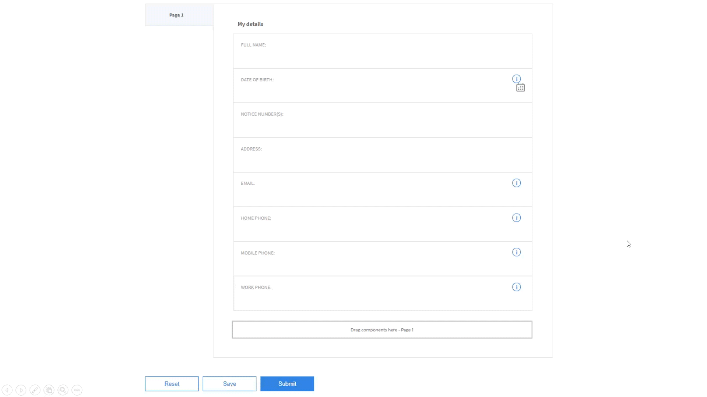
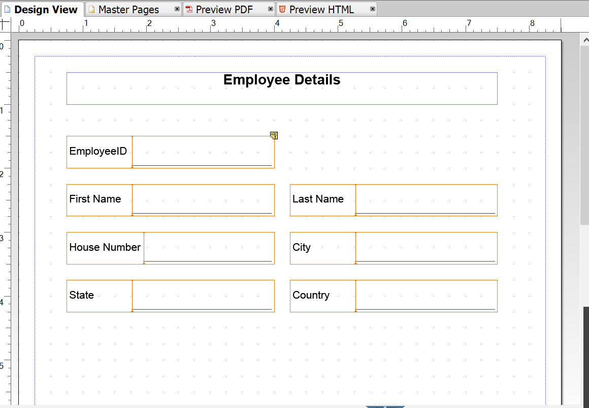
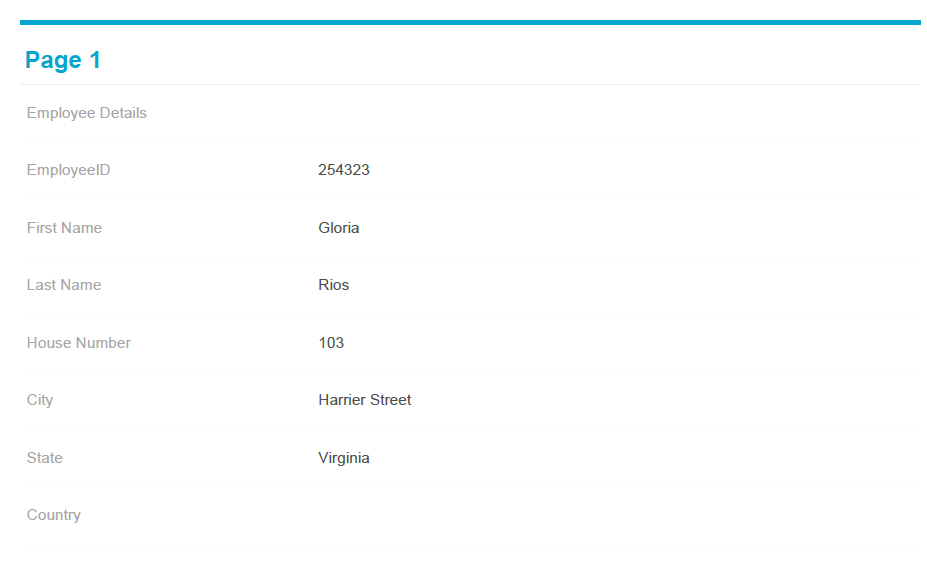
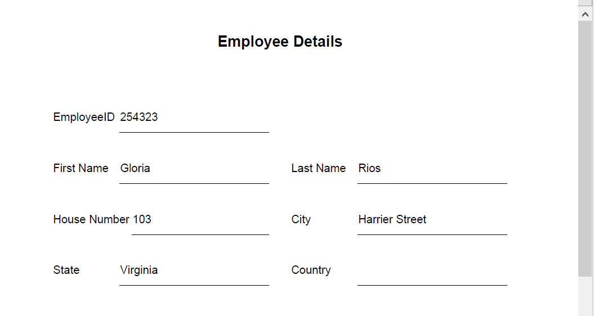
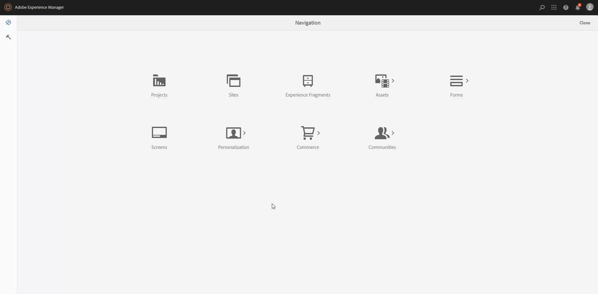
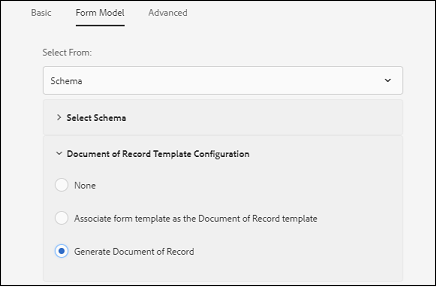
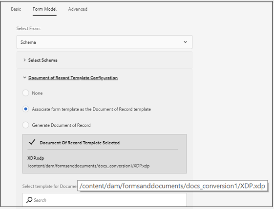

# Fluxos de trabalho recomendados para habilitar a geração de documentos de registro para formulários adaptáveis {#recommended-workflows-dor-generation}

O Documento de registro (DoR) permite manter um registro das informações fornecidas e submetê-las em um formulário adaptável para que você possa consultá-las posteriormente.
O DoR usa um modelo base para definir seu layout. Você pode gerar uma DoR usando um modelo padrão ou associando qualquer outro modelo ao formulário adaptável.

Para obter mais informações sobre como gerar uma DoR, consulte [Gerar documento de registro para formulários adaptáveis](https://helpx.adobe.com/br/experience-manager/6-5/forms/using/generate-document-of-record-for-non-xfa-based-adaptive-forms.html).

O [AFCS (Serviço de Conversão Automatizada de Formulários)](/help/using/introduction.md) converte os seguintes formulários de origem em formulários adaptáveis:

* PDF forms não interativo
* Acro Forms
* PDF forms baseado em XFA

Com base no formulário de origem usado para conversão, é possível gerar uma DoR usando:

* um template padrão
* o formulário de origem como modelo - Se você selecionar essa opção, o serviço de conversão associará automaticamente o formulário de origem ao formulário adaptável convertido como o modelo DoR.
* associar qualquer outro modelo ao formulário adaptável convertido

A tabela a seguir ilustra um exemplo de como o modelo DoR usado afeta o layout do DoR gerado:

<table> 
 <tbody>
 <tr>
  <td>
<strong>Formulário do Source</strong>
</td>
  <td>
<strong>DoR gerado</strong>
</td> 
   </tr>
  <tr>
   <td></td>
   <td>
Se você usar o template padrão para gerar DoR: </td>
   </tr>
   <tr>
   <td></td>
   <td>
Se você usar o formulário de origem como modelo para gerar DoR: 
</td>
   </tr>
  </tbody>
</table>

Conforme ilustrado na tabela, se você usar o formulário de origem como modelo, o DoR manterá o layout do formulário de origem.
Este artigo descreve os caminhos recomendados para gerar uma DoR com base nos três tipos de formulários de origem.

<table> 
 <tbody> 
  <tr> 
   <th><strong>Formulário do Source</strong></th> 
   <th><strong>Métodos para gerar DoR</strong></th> 
  </tr> 
  <tr> 
   <td>
PDF forms não interativo
</td> 
   <td> 
    <ul> 
     <li><a href="#generate-document-of-record-using-cloud-configuration">Habilite a geração de DoR antes da conversão do formulário adaptável para gerar DoR usando um modelo padrão</a></li> 
     <li><a href="#edit-adaptive-form-properties-generate-document-of-record">Editar propriedades do formulário adaptável após a conversão do formulário adaptável para habilitar a geração de DoR usando o padrão ou qualquer outro modelo de formulário</a></li> 
    </ul> </td> 
  </tr>
  <tr> 
   <td>
Acro Forms ou PDF forms com base em XFA
</td> 
   <td> 
    <ul> 
     <li><a href="#use-input-form-as-template-to-generate-document-of-record">Habilite a geração de DoR antes da conversão do formulário adaptável para gerar DoR usando o formulário de origem como modelo</a></li> 
     <li><a href="#edit-adaptive-form-properties-to-generate-document-of-record">Edite as propriedades do formulário adaptável após a conversão do formulário adaptável para habilitar a geração de DoR usando o modelo padrão, o formulário de origem como modelo ou qualquer outro modelo de formulário</a></li> 
    </ul> </td> 
  </tr>    
 </tbody> 
</table>

## Gerar documento de registro para PDF forms não interativo {#generate-document-of-record-non-interactive-pdf}

Se estiver usando um formulário não interativo do PDF como o formulário de origem do serviço de conversão automática de formulários (AFCS), você poderá:

* habilite a geração de DoR antes da conversão do formulário adaptável para gerar DoR usando um modelo padrão
* ou edite as propriedades do formulário adaptável após a conversão do formulário adaptável para habilitar a geração de DoR usando o padrão ou qualquer outro modelo de formulário

### Habilitar geração de DoR antes da conversão para gerar DoR usando o modelo padrão {#generate-document-of-record-using-cloud-configuration}

1. Selecione **[!UICONTROL Tools]** > **[!UICONTROL Cloud Services]** > **[!UICONTROL Automated Forms Conversion Configuration]** > Propriedades da configuração de nuvem usadas para conversão > **[!UICONTROL Advanced]** > opção **[!UICONTROL Generate Document of Record]**.

   

1. Toque em **[!UICONTROL Save & Close]** para salvar as configurações.

1. [Executar a conversão](/help/using/convert-existing-forms-to-adaptive-forms.md). Certifique-se de usar a configuração de nuvem editada na etapa 1 dessas instruções.
Ao enviar o formulário adaptável convertido, o DoR é gerado automaticamente usando o modelo padrão.

### Editar propriedades do formulário adaptável após a conversão para habilitar a geração de DoR {#edit-adaptive-form-properties-generate-document-of-record}

Se você não habilitar a geração de DoR antes de converter o formulário de origem em um formulário adaptável, ainda poderá fazer isso após a conversão.

1. [Execute a conversão](/help/using/convert-existing-forms-to-adaptive-forms.md) no formulário não interativo do PDF para gerar um formulário adaptável.

1. Selecione o formulário adaptável na pasta **[!UICONTROL output]** e toque em **[!UICONTROL Properties]**.

1. Na guia **[!UICONTROL Form Model]**, expanda a seção **[!UICONTROL Document of Record Template Configuration]** e selecione **[!UICONTROL Generate Document of Record]**.

   

1. Toque em **[!UICONTROL Save & Close]** para salvar as configurações.

Ao enviar o formulário adaptável convertido, o DoR é gerado automaticamente usando o modelo padrão. Se quiser associar qualquer outro modelo DoR ao formulário adaptável convertido, selecione a opção **[!UICONTROL Associate form template as the Document of Record template]**.

## Gerar documento de registro para Acro Forms ou PDF forms baseado em XFA {#generate-document-of-record-acroform-xfaform}

Se você estiver usando um formulário do Acro Form ou PDF baseado em XFA como o formulário de origem do serviço de conversão automática de formulários (AFCS), é possível:

* habilite a geração de DoR antes da conversão do formulário adaptável para gerar DoR usando o formulário de origem como modelo

* ou edite as propriedades do formulário adaptável após a conversão do formulário adaptável para habilitar a geração de DoR usando o modelo padrão, o formulário de origem como modelo ou qualquer outro modelo de formulário

### Habilite a geração de DoR antes da conversão para gerar DoR usando o modelo de formulário de origem {#use-input-form-as-template-to-generate-document-of-record}

1. Selecione **[!UICONTROL Tools]** > **[!UICONTROL Cloud Services]** > **[!UICONTROL Automated Forms Conversion Configuration]** > Propriedades da configuração de nuvem usadas para conversão > **[!UICONTROL Advanced]** > opção **[!UICONTROL Generate Document of Record]**.

1. Toque em **[!UICONTROL Save & Close]** para salvar as configurações.

1. [Executar a conversão](/help/using/convert-existing-forms-to-adaptive-forms.md). Certifique-se de usar a configuração de nuvem editada na etapa 1 dessas instruções.
O serviço de conversão associa automaticamente o formulário do Acro Form ou do PDF baseado em XFA ao formulário adaptável convertido como o modelo do DoR.
É possível abrir as propriedades do formulário adaptável para exibir o modelo DoR na seção **[!UICONTROL Document of Record Template Configuration]** da guia **[!UICONTROL Form Model]**.

   

   Ao enviar o formulário adaptável convertido, o DoR é gerado automaticamente usando o modelo de formulário de origem.

### Editar propriedades do formulário adaptável após a conversão para habilitar a geração de DoR {#edit-adaptive-form-properties-to-generate-document-of-record}

1. [Execute a conversão](/help/using/convert-existing-forms-to-adaptive-forms.md) no formulário não interativo do PDF para gerar um formulário adaptável.

1. Selecione o formulário adaptável na pasta **[!UICONTROL output]** e toque em **[!UICONTROL Properties]**.

1. Na guia **[!UICONTROL Form Model]**, expanda a seção **[!UICONTROL Document of Record Template Configuration]** e selecione **[!UICONTROL Generate Document of Record]** para habilitar a geração de DoR usando o modelo padrão.
Você também pode selecionar a opção **[!UICONTROL Associate form template as the Document of Record template]** e selecionar o modelo para habilitar a geração de DoR usando o modelo de formulário de origem ou qualquer outro modelo de formulário.

1. Toque em **[!UICONTROL Save & Close]** para salvar as configurações.
