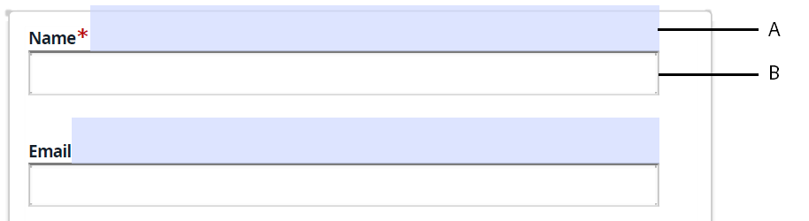

# Problemas conhecidos e limitações {#known-issues-limitations}

Antes de começar a usar o AFCS (AEM Forms Automated forms conversion Service), analise os seguintes problemas e limitações conhecidos:

## Problemas conhecidos {#known-issues}

* A pasta que contém formulários para conversão não deve ter mais de 15 formulários e 50 páginas no total. O tamanho da pasta de origem não deve exceder 10 MB. Não criar subpastas na pasta de origem.
* Alguns objetos de formulário são facilmente visíveis para o olho humano, mas são [difícil de identificar para o serviço](styles-and-pattern-considerations-and-best-practices.md). Uso [Revisar e corrigir o editor](review-correct-ui-edited.md) para identificar e converter esses objetos de formulário.
* Editor de revisão e correção:

   * Não tem ação de desfazer. O botão Salvar salva as alterações permanentemente.
   * Não suporta painéis repetíveis para formulários baseados em XFA.
   * Se você modificar uma lista em uma tabela usando o editor Revisar e corrigir, a largura da linha não será ajustada automaticamente e o texto poderá passar para a próxima linha da tabela.
   * A variável **[!UICONTROL Auto-detect multi-column layout from input forms]** O recurso não funciona com o editor de Revisar e corrigir e Fragmentos de formulário.
   * A assinatura de script criada com o editor de Revisar e corrigir falha ao carregar formulários adaptáveis publicados.

* Para formulários XFA:
   * A extração de fragmentos de um formulário baseado em XFA não é compatível.
   * Os scripts XFA não são compatíveis. Por exemplo, scripts para gerar automaticamente valores para um componente suspenso.
   * O modelo meta não funciona para o grupo de opções
   * A opção Grupos de opções com um único caractere não é identificada
   * Quando o documento de origem é um XFA (.XDP) dinâmico e ele [define o comportamento das propriedades XFA em um formulário adaptável](https://helpx.adobe.com/experience-manager/6-5/forms/using/xfa-api-supported-in-adaptive-form.html#supportedxfaelementsandtheirmappinginadaptiveformsbr), a propriedade de presença do documento de origem não será aplicada. Por exemplo, um campo no documento de origem é marcado como oculto e um script torna o campo visível, em seguida, o campo permanece visível no formulário adaptável de saída.

* Quando você usa o **Usar o AcroForm de entrada como Documento de registro (DoR) para formulários adaptáveis gerados** considere o seguinte:

<table>
    <tr>
        <td>A ligação e os dados são perdidos para campos de texto composto. Um campo de texto composto tem várias caixas de texto alinhadas umas com as outras. Por exemplo, em um AcroForm, um número de cartão de crédito é dividido em várias caixas de texto e cada caixa de texto tem uma vinculação separada. Quando o AcroForm é convertido em formulário adaptável, o formulário adaptável convertido tem uma única vinculação para todas as caixas de texto. Como solução, antes de converter um AcroForm em um formulário adaptável, modifique o AcroForm para usar uma única caixa de texto para aceitar números de cartão de crédito.</td>
        <td>                                                            </td>
    </tr>
    <tr>
        <td>A ligação e os dados são perdidos para campos de data compostos. Um campo de data composto é composto de três campos diferentes. Por exemplo, um campo de data de nascimento em um AcroForm é dividido em três campos separados. O formulário adaptável fornece um componente seletor de datas pronto para uso. Para usar o componente seletor de datas do formulário adaptável enquanto mantém a vinculação do AcroForm, antes de converter um AcroForm em um formulário adaptável, modifique o AcroForm para usar um campo de data único.</td>
        <td></td>
    </tr>
    <tr>
        <td>Se o tamanho das caixas de seleção for maior que o texto que as acompanha, as caixas de seleção não serão detectadas e a vinculação no AcroForm será perdida. Modifique o AcroForm para tornar o tamanho das caixas de seleção menor do que o texto que o acompanha.</td>
        <td> </td>
    </tr>
    <tr>
        <td>Se os campos de entrada não se alinharem ao campo de texto correspondente, o campo de entrada não será detectado.  </td>
        <td></td>
    </tr>
    <tr >
        <td>O serviço converte todas as caixas de seleção de um AcroForm em grupos de opções separados. Grupos de escolha separados são criados para preservar associações com o AcroForm. Não mescle grupos de escolha no formulário adaptável. Isso levará à perda de vínculos. Se você mesclar os grupos de escolha, converta o formulário novamente para recuperar as associações perdidas. </td>
        <td></td>
    </tr>
    <tr >
        <td>Os limites de algumas tabelas são estendidos para fora da página no Documento de registro (DoR) gerado automaticamente. </td>
        <td></td>
    </tr>
</table>

## Limitações {#limitations}

* PDF forms com layout dinâmico complexo, campos com contorno pontilhado ou campos preenchidos não são compatíveis.
* As imagens e o texto dentro das imagens não são identificados. Adicionar imagens manualmente a formulários convertidos.
* Documentos XDP de arte não são compatíveis.
* Não há suporte para PDF forms com mais de 15 páginas.
* Documentos criptografados, protegidos por senha e protegidos não são convertidos. Remova criptografia ou senhas antes de executar a conversão.
* Tabelas complexas como tabelas sem borda, tabelas aninhadas e tabelas com valores de espaço reservado não são compatíveis. Use o editor de formulário adaptável para adicionar ou modificar tabelas complexas, após a conversão. Somente tabelas simples, com campos vazios, cabeçalhos adequados e limites claros são suportados.
* O serviço converte apenas formulários em inglês, francês, alemão, espanhol, italiano e português para formulários adaptáveis. É possível traduzir formulários adaptáveis convertidos para outro idioma usando [Fluxo de trabalho de tradução do AEM](https://helpx.adobe.com/br/experience-manager/6-5/forms/using/using-aem-translation-workflow-to-localize-adaptive-forms.html).
* O AEM 6.4 Forms não é compatível com a detecção automática de layout de várias colunas de formulários de entrada.
* As informações codificadas usando cores no formulário de PDF de origem não são transferidas para o formulário adaptável.
* As cores do formulário de PDF de origem não são transferidas para temas de formulário adaptáveis.
* Os PDF forms coloridos são tratados como formulários em tons de cinza e os campos são detectados adequadamente.
