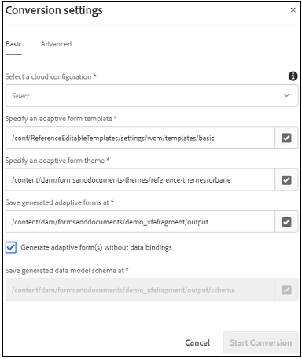

# Preenchimento e fluxos de trabalho recomendados com base na fonte de dados para formulários adaptáveis {#recommended-data-source-btased-prefill-and-submit-workflows-for-adaptive-forms}

Você pode usar qualquer uma das seguintes fontes de dados com formulários adaptáveis convertidos usando o serviço do Automated forms conversion (AFCS):

* Modelo de dados de formulário, OData ou qualquer outro serviço de terceiros
* Esquema JSON
* Esquema XSD

Com base na fonte de dados, você pode optar por gerar um formulário adaptável com ou sem um modelo de dados.

Este artigo descreve os fluxos de trabalho recomendados para preencher previamente os valores dos campos e as opções de envio após selecionar uma fonte de dados e gerar um formulário adaptável usando o serviço de conversão.

<table> 
 <tbody> 
  <tr> 
   <th><strong>Fonte de Dados</strong></th> 
   <th><strong>Fluxo de trabalho recomendado</strong></th> 
  </tr> 
  <tr> 
   <td><p>Modelo de dados de formulário, OData ou qualquer outro serviço de terceiros</p></td> 
   <td> 
    <p><strong>Opção 1</strong>: você seleciona modelo de dados de formulário, OData ou qualquer outro serviço de terceiros como fonte de dados. Você <a href="#generate-adaptive-forms-with-no-data-binding">gera um formulário adaptável sem associação de dados</a> usando o serviço de Automated forms conversion (AFCS). Você vincula os campos de formulário adaptáveis a entidades de modelo de dados de formulário manualmente e usa a opção Serviço de preenchimento prévio do modelo de dados de formulário para preencher previamente os valores de campo. Use a opção Enviar usando modelo de dados de formulário para enviar o formulário adaptável.</p></td> 
  </tr>
  <tr> 
   <td></td> 
   <td> 
   <p><strong>Opção 2</strong>: você seleciona modelo de dados de formulário, OData ou qualquer outro serviço de terceiros como fonte de dados. Você <a href="#generate-adaptive-forms-with-no-data-binding">gera um formulário adaptável sem associação de dados</a> usando o serviço de Automated forms conversion (AFCS). Você vincula os campos de formulário adaptáveis usando o editor de regras para preencher previamente os valores dos campos. Modifique os valores de campo, se necessário, e envie dados para o repositório crx.</p>
    </td> 
  </tr>
  <tr> 
   <td></td> 
   <td> 
    <p>Para obter instruções passo a passo para executar esses fluxos de trabalho, consulte <a href="#sqldatasource">Usar banco de dados, OData ou qualquer serviço de terceiros como fonte de dados.</a></p> </td> 
  </tr>
  <tr>
  <td><p>Esquema JSON</p></td> 
   <td> 
    <p>Selecione Esquema JSON como fonte de dados. Com base na fonte de dados selecionada:</p></td> 
  </tr>
  <tr>
  <td></td> 
   <td> 
    <p><strong>Opção 1</strong>: você <a href="#generate-adaptive-forms-with-no-data-binding">gera um formulário adaptável sem associação de dados</a> usando o serviço de Automated forms conversion (AFCS) e configura o esquema JSON como a fonte de dados. Você associa os campos de formulário adaptável ao esquema JSON manualmente e <a href="https://helpx.adobe.com/br/experience-manager/6-5/forms/using/prepopulate-adaptive-form-fields.html#Supportedprotocolsforprefillinguserdata" target="_blank">usa qualquer um dos protocolos </a> compatíveis para preencher previamente os valores de campo. Modifique os valores de campo, se necessário, e envie dados para o repositório crx.</p></td> 
  </tr>
  <tr>
  <td></td> 
   <td> 
    <p>Para obter instruções passo a passo sobre como executar os fluxos de trabalho, consulte <a href="#jsondatasource">Usar esquema JSON como fonte de dados.</p></td> 
  </tr>
  <tr>
  <td></td> 
   <td> 
    <p><strong>Opção 2</strong>: você <a href="#generate-adaptive-forms-with-json-binding">gera um formulário adaptável com associação de dados JSON</a> usando o serviço de Automated forms conversion (AFCS). O serviço de preenchimento prévio e o envio de formulário funcionam perfeitamente. Você não precisa de nenhuma etapa de configuração.</p> </td> 
  </tr>
   <tr>
  <td></td> 
   <td> 
    <p>Para obter instruções passo a passo sobre como executar os fluxos de trabalho, consulte <a href="#jsonwithdatabinding">Usar esquema JSON como fonte de dados.</a></p> </td> 
  </tr>
  <tr>
  <td><p>Esquema XSD</p></td> 
   <td> 
    <p>Selecione Esquema XSD como fonte de dados. Com base na fonte de dados selecionada, você <a href="#generate-adaptive-forms-with-no-data-binding">gera um formulário adaptável sem associação de dados</a> usando o serviço de Automated forms conversion (AFCS) e configura o esquema XSD como fonte de dados. Você associa os campos de formulário adaptável ao esquema XSD manualmente e <a href="https://helpx.adobe.com/br/experience-manager/6-5/forms/using/prepopulate-adaptive-form-fields.html#Supportedprotocolsforprefillinguserdata" target="_blank">usa qualquer um dos protocolos</a> compatíveis para preencher previamente os valores de campo. Modifique os valores de campo, se necessário, e envie dados para o repositório crx.</p>
    </td> 
  </tr>
  <tr>
  <td></td> 
   <td> 
    <p>Para obter instruções passo a passo sobre como executar os fluxos de trabalho, consulte <a href="#xsddatasource">Usar esquema XSD como fonte de dados.</a></p>
    </td> 
  </tr>
 </tbody> 
</table>


Para obter mais informações sobre o serviço Automated forms conversion (AFCS), consulte os seguintes artigos:

* [Introdução ao serviço do Automated forms conversion](introduction.md)
* [Configurar o serviço Automated forms conversion](configure-service.md)
* [Converter formulários impressos em formulários adaptáveis](convert-existing-forms-to-adaptive-forms.md)
* [Revisar e corrigir formulários convertidos](review-correct-ui-edited.md)

As informações fornecidas neste artigo baseiam-se no pressuposto de que qualquer pessoa que as leia tem conhecimento básico dos conceitos de formulários adaptáveis.

## Pré-requisitos {#pre-requisites}

* Configurar uma [instância de autor do AEM](https://helpx.adobe.com/br/experience-manager/6-5/sites/deploying/using/deploy.html)
* Configurar o [serviço de Automated forms conversion (AFCS) na instância de autor AEM](configure-service.md)

## Exemplo de formulário adaptável {#sample-adaptive-form}

Para executar os casos de uso para preencher previamente os valores de campo em um formulário adaptável e enviá-los à fonte de dados, baixe o seguinte arquivo de PDF de amostra.

Exemplo de formulário de pedido de empréstimo

[Obter arquivo](assets/sample_loan_application_form.pdf)

O arquivo PDF serve como entrada para o serviço de Automated forms conversion (AFCS). O serviço converte esse arquivo em um formulário adaptável. A imagem a seguir mostra o aplicativo de empréstimo de exemplo em formato PDF.


## Preparar dados para o modelo de formulário {#prepare-data-for-form-model}

A Integração de dados do AEM Forms permite configurar e conectar-se a diferentes fontes de dados. Depois de gerar um formulário adaptável usando o processo de conversão, você pode definir o modelo de formulário com base em um modelo de dados de formulário, XSD ou um esquema JSON. Você pode usar um banco de dados, o Microsoft Dynamics ou qualquer outro serviço de terceiros para criar um modelo de dados de formulário.

Este tutorial usa o banco de dados MySQL como a fonte para criar um modelo de dados de formulário. Crie um esquema **loanapplication** no banco de dados e adicione uma tabela **candidate** ao esquema com base nos campos disponíveis no formulário adaptável.


Você pode usar a seguinte instrução DDL para criar a tabela **candidato** no banco de dados.

```sql
CREATE TABLE `applicant` (
   `name` varchar(45) DEFAULT NULL,
   `address` varchar(45) DEFAULT NULL,
   `phonenumber` int(11) NOT NULL,
   `email` varchar(45) DEFAULT NULL,
   `occupation` varchar(45) DEFAULT NULL,
   `annualsalary` varchar(45) DEFAULT NULL,
   `familymembers` int(11) DEFAULT NULL,
   PRIMARY KEY (`phonenumber`)
 ) ENGINE=InnoDB DEFAULT CHARSET=utf8
```

Se você estiver usando um esquema XSD como o modelo de formulário para executar os casos de uso, crie um arquivo XSD com o seguinte texto:

```xml
<?xml version="1.0" encoding="utf-8" ?>
    <xs:schema targetNamespace="http://adobe.com/sample.xsd"
                    xmlns="http://adobe.com/sample.xsd"
                    xmlns:xs="http://www.w3.org/2001/XMLSchema">

<xs:element name="sample" type="SampleType"/>

  <xs:complexType name="SampleType">
    <xs:sequence>
      <xs:element name="name" type="xs:string"/>
   <xs:element name="address" type="xs:string"/>
   <xs:element name="phonenumber" type="xs:int"/>
   <xs:element name="email" type="xs:string"/>
   <xs:element name="occupation" type="xs:string"/>
   <xs:element name="annualsalary" type="xs:string"/>
   <xs:element name="familymembers" type="xs:string"/>
 </xs:sequence>
  </xs:complexType>

  </xs:schema>
```

Ou baixe o esquema XSD para o sistema de arquivos local.

Exemplo de esquema XSD de aplicativo de empréstimo

[Obter arquivo](assets/loanapplication.xsd)

Para obter mais informações sobre como usar o esquema XSD como modelo de formulário em formulários adaptáveis, consulte [Criando formulários adaptáveis usando o esquema XML](https://helpx.adobe.com/br/experience-manager/6-5/forms/using/adaptive-form-xml-schema-form-model.html).

Se estiver usando um esquema JSON como modelo de formulário para executar os casos de uso, crie um arquivo JSON com o seguinte texto:

```JSON
{
    "$schema": "http://json-schema.org/draft-04/schema#",
    "definitions": {
        "loanapplication": {
            "type": "object",
            "properties": {
                "name": {
                    "type": "string"
                },
                "address": {
                    "type": "string"
                },
    "phonenumber": {
                    "type": "number"
                },
    "email": {
                    "type": "string"
                },
    "occupation": {
                    "type": "string"
                },
    "annualsalary": {
                    "type": "string"
                },
    "familymembers": {
                    "type": "number"
                }
            }
        }
 },
 "type": "object",
    "properties": {
        "employee": {
            "$ref": "#/definitions/loanapplication"
        }
    }
}
```

Ou baixe o esquema JSON no sistema de arquivos local.

Esquema JSON do aplicativo de empréstimo de exemplo

[Obter arquivo](assets/demo_schema.json)

Para obter mais informações sobre como usar o esquema JSON como modelo de formulário em formulários adaptáveis, consulte [Criação de formulários adaptáveis usando o esquema JSON](https://helpx.adobe.com/br/experience-manager/6-5/forms/using/adaptive-form-json-schema-form-model.html).

## Gerar formulários adaptáveis sem associação de dados {#generate-adaptive-forms-with-no-data-binding}

Use o [serviço Automated forms conversion para converter](convert-existing-forms-to-adaptive-forms.md) o [formulário de aplicativo de empréstimo de exemplo](#sample-adaptive-form) em um formulário adaptável sem associação de dados. Marque a caixa de seleção **[!UICONTROL Generate adaptive form(s) without data bindings]** para gerar o formulário adaptável sem associação de dados.



Depois de gerar um formulário adaptável sem associação de dados, selecione uma fonte de dados para o formulário adaptável:

* [Banco de dados, OData ou qualquer serviço de terceiros](#sqldatasource)
* [Esquema JSON](#jsondatasource)
* [Esquema XSD](#xsddatasource)

>[!NOTE]
> Se o formulário adaptável convertido usando o serviço Automated forms conversion (AFCS) contiver vários campos com o mesmo nome, verifique se esses campos estão vinculados a entidades de fonte de dados para evitar uma possível perda de dados durante o envio.
>

### Usar banco de dados, OData ou qualquer serviço de terceiros como fonte de dados {#sqldatasource}

Caso de uso: você gera um formulário adaptável sem vínculo de dados usando o serviço do Automated forms conversion (AFCS) e configura o banco de dados MYSQL como a fonte de dados. Você associa os campos de formulário adaptáveis a entidades de modelo de dados de formulário manualmente e usa a opção **[!UICONTROL Form Data Model Prefill Service]** para preencher previamente os valores de campo. Você usa a opção **[!UICONTROL Submit using Form Data Model]** para enviar o formulário adaptável.

Antes de executar o caso de uso:

* [Configurar o banco de dados MySQL como a fonte de dados](https://helpx.adobe.com/br/experience-manager/6-5/forms/using/configure-data-sources.html#configurerelationaldatabase)
* [Criar o modelo de dados de formulário](https://helpx.adobe.com/br/experience-manager/6-5/forms/using/work-with-form-data-model.html)

Com base no caso de uso, crie o modelo de dados de formulário **loanapplication** e associe o argumento do serviço de leitura a um valor **[!UICONTROL Literal]**. O valor literal do número de telefone deve ser de um dos registros configurados no esquema **candidato** do banco de dados MySQL. Os serviços usam o valor como argumento para buscar detalhes da fonte de dados. Você também pode selecionar [Atributo de perfil de usuário ou Solicitar atributo](https://helpx.adobe.com/br/experience-manager/6-5/forms/using/work-with-form-data-model.html#bindargument) na lista suspensa **[!UICONTROL Binding To]**


>[!NOTE]
>
>Adicione os serviços **get** e **insert** ao modelo de dados de formulário, configure e teste os serviços antes de executar o caso de uso.

Execute as seguintes etapas:

1. Selecione o **formulário de aplicativo de empréstimo de amostra** convertido, disponível na pasta **[!UICONTROL output]**, e toque em **[!UICONTROL Properties]**.
1. Toque na guia **[!UICONTROL Form Model]**, selecione **[!UICONTROL Form Data Model]** na lista suspensa **[!UICONTROL Select From]** e toque em **[!UICONTROL Select Form Data Model]** para selecionar o modelo de dados de formulário **loanapplication**. Toque em **[!UICONTROL Save & Close]** para salvar o formulário.
1. Selecione o **formulário de aplicativo de empréstimo de exemplo** e toque em **[!UICONTROL Edit]**.
1. Na guia **[!UICONTROL Content]**, toque no ícone configurar:

   

   1. Na seção **[!UICONTROL Basic]**, selecione **[!UICONTROL Form Data Model Prefill service]** na lista suspensa **[!UICONTROL Prefill Service]**.

   1. Na seção **[!UICONTROL Submission]**, selecione **[!UICONTROL Submit using Form Data Model]** na lista suspensa **[!UICONTROL Submit Action]**.

   1. Selecione o modelo de dados usando o campo **[!UICONTROL Data Model to submit]**.
   1. Toque no  para salvar as propriedades.

1. Toque na caixa de texto Nome do Candidato e selecione  (Configurar).

   1. No campo Referência de Ligação, selecione **Candidato** > **Nome** e toque no  para salvar as propriedades. Da mesma forma, crie uma associação de dados para o **Endereço**, **Número de Telefone**, **Email**, **Ocupação**, **Salário Anual (em dólares)** e **Não. de campos de membros da família dependentes** com as entidades de modelo de dados de formulário.

   

1. Toque em **[!UICONTROL Preview]** para exibir os valores de campos de formulário adaptável preenchidos previamente.
1. Modifique os valores do campo, se necessário, e envie o formulário adaptável. Os valores de campo são enviados ao banco de dados MySQL. Você pode atualizar a tabela **candidato** no banco de dados para exibir os valores atualizados na tabela.

**Caso de uso:** gere um formulário adaptável sem associação de dados usando o serviço de Automated forms conversion (AFCS) e configure o banco de dados MYSQL como a fonte de dados. Você vincula os campos de formulário adaptáveis usando o editor de regras para preencher previamente os valores dos campos. Modifique os valores de campo, se necessário, e envie dados para o repositório crx.

Execute as seguintes etapas para usar o [editor de regras](https://helpx.adobe.com/br/experience-manager/6-5/forms/using/rule-editor.html) para chamar o serviço de modelo de dados de formulário para associar campos e valores de preenchimento prévio em um formulário adaptável:

1. Selecione o **formulário de aplicativo de empréstimo de amostra** na pasta **[!UICONTROL output]** e toque em **[!UICONTROL Edit]**.
1. Na guia **[!UICONTROL Content]**, toque no ícone configurar:

   

   Na seção **[!UICONTROL Basic]**, selecione **[!UICONTROL Form Data Model Prefill service]** na lista suspensa **[!UICONTROL Prefill Service]**.

1. Toque na caixa de texto **[!UICONTROL Applicant Name]** e em **[!UICONTROL Edit Rules]**.

   

1. Toque em **[!UICONTROL Create]** na página Editor de regras.
1. Na página **[!UICONTROL Rule Editor]**:

   1. Selecione um estado para a caixa de texto Nome do Candidato. Por exemplo, **[!UICONTROL is initialized]**, que resulta na execução da condição **[!UICONTROL Then]** quando você renderiza o formulário no modo **[!UICONTROL Preview]**.

   1. Na seção **[!UICONTROL Then]**, selecione **[!UICONTROL Invoke Service]** na lista suspensa **[!UICONTROL Select Action]**. Todos os serviços na instância do Forms são exibidos na lista suspensa.

   1. Selecione um serviço **[!UICONTROL Get]** na seção que lista os modelos de dados de formulário. O campo Entrada exibe **phonenumber**, que é a chave primária definida para o modelo de dados **candidato**. O sistema recupera e preenche os valores no formulário adaptável para campos na seção Saída com base nesse campo.

   1. Crie uma associação para os campos de formulário adaptáveis com as entidades de modelo de dados de formulário usando a seção Saída. Por exemplo, vincule o campo de formulário adaptável **[!UICONTROL Applicant Name]** à entidade **name**.

   1. Toque em **[!UICONTROL Done]**. Toque novamente em **[!UICONTROL Done]** na página Editor de regras.

   

1. Toque em **[!UICONTROL Preview]** para exibir os valores de campos de formulário adaptável preenchidos previamente.

   >[!NOTE]
   >
   >Verifique se a Propriedade **[!UICONTROL Return Array]** está definida como DESATIVADA para a propriedade de serviço **get** no modelo de dados de formulário associado ao formulário adaptável.

1. Modifique os valores do campo, se necessário, e envie o formulário adaptável. Os dados enviados estão disponíveis no seguinte local no repositório crx:

   `http://host name:port/crx/de/index.jsp#/content/forms/fp/admin/submit/data/latest file available in the folder`

### Usar esquema JSON como fonte de dados {#jsondatasource}

**Caso de uso:** gere um formulário adaptável sem associação de dados usando o serviço de Automated forms conversion (AFCS) e configure o esquema JSON como a fonte de dados. Você associa os campos de formulário adaptável ao esquema JSON manualmente e usa a opção **Visualizar com dados** para preencher previamente os valores de campo. Modifique os valores de campo, se necessário, e envie dados para o repositório crx.

Antes de executar o caso de uso, verifique se você:

* [um esquema JSON válido compatível com a estrutura do esquema JSON](#prepare-data-for-form-model)
* [um formulário adaptável sem vínculo de dados](#generate-adaptive-forms-with-no-data-binding)

Execute as seguintes etapas:

1. Selecione o **formulário de aplicativo de empréstimo de amostra** convertido, disponível na pasta **saída**, e toque em **[!UICONTROL Properties]**.
1. Toque na guia **[!UICONTROL Form Model]**, selecione **[!UICONTROL Schema]** na lista suspensa **[!UICONTROL Select From]** e toque em **[!UICONTROL Select Schema]** para carregar o esquema **demo.schema JSON** salvo no sistema de arquivos local. Toque em **[!UICONTROL Save & Close]** para salvar o formulário.
1. Selecione o **formulário de aplicativo de empréstimo de exemplo** e toque em **[!UICONTROL Edit]**.
1. Toque na caixa de texto Nome do Candidato e selecione  (Configurar).

   No campo Referência de Ligação, selecione **Candidato** > **Nome** e toque no  para salvar as propriedades. Da mesma forma, crie uma associação de dados para o **Endereço**, **Número de Telefone**, **Email**, **Ocupação**, **Salário Anual (em dólares)** e **Não. de membros da família dependentes** campos com as entidades do esquema JSON.

1. Selecione o **formulário de aplicativo de empréstimo de amostra** convertido disponível na pasta **[!UICONTROL output]** novamente e selecione **[!UICONTROL Preview]** > **[!UICONTROL Preview with Data]**.</br>

   Baixar arquivo de dados de exemplo</br>

   [Obter arquivo](assets/json_data_file.txt)</br>

1. Modifique os valores do campo, se necessário, e envie o formulário adaptável. Os dados enviados estão disponíveis no seguinte local no repositório crx:

   `http://host name:port/crx/de/index.jsp#/content/forms/fp/admin/submit/data/latest file available in the folder`

### Usar esquema XSD como fonte de dados {#xsddatasource}

**Caso de uso:** gere um formulário adaptável sem associação de dados usando o serviço de Automated forms conversion (AFCS) e configure o esquema XSD como a fonte de dados. Você associa os campos de formulário adaptável ao esquema XSD manualmente e usa a **Visualização com dados** para preencher previamente os valores de campo. Modifique os valores de campo, se necessário, e envie dados para o repositório crx.

Antes de executar o caso de uso, verifique se você:

* [um esquema XSD válido compatível com a estrutura do esquema XML](#prepare-data-for-form-model)
* [um formulário adaptável sem vínculo de dados](#generate-adaptive-forms-with-no-data-binding)

Execute as seguintes etapas:

1. Selecione o **formulário de aplicativo de empréstimo de amostra** convertido, disponível na pasta **[!UICONTROL output]**, e toque em **[!UICONTROL Properties]**.
1. Toque na guia **[!UICONTROL Form Model]**, selecione **[!UICONTROL Schema]** na lista suspensa **[!UICONTROL Select From]** e toque em **[!UICONTROL Select Schema]** para carregar o esquema XSD **loanapplication** salvo no sistema de arquivos local. Selecione o elemento raiz para o esquema XSD e toque em **[!UICONTROL Save & Close]** para salvar o formulário.
1. Selecione o **formulário de aplicativo de empréstimo de exemplo** e toque em **[!UICONTROL Edit]**.
1. Toque na caixa de texto Nome do Candidato e selecione  (Configurar).
No campo Referência de Ligação, selecione **Candidato** > **Nome** e toque em  para salvar as propriedades. Da mesma forma, crie uma associação de dados para o **Endereço**, **Número de Telefone**, **Email**, **Ocupação**, **Salário Anual (em dólares)** e **Não. de membros da família dependentes** campos com as entidades do esquema XSD.

1. Selecione novamente o **formulário de aplicativo de empréstimo de amostra** convertido, disponível na pasta **saída**, e selecione **[!UICONTROL Preview]** > **[!UICONTROL Preview with Data]**.</br>

   Baixar arquivo de dados de exemplo</br>

   [Obter arquivo](assets/loan-application-data-xml-data.zip)</br>


1. Modifique os valores do campo, se necessário, e envie o formulário adaptável. Os dados enviados estão disponíveis no seguinte local no repositório crx:

   `http://host name:port/crx/de/index.jsp#/content/forms/fp/admin/submit/data/latest file available in the folder`

## Gerar formulários adaptáveis com vinculação JSON {#generate-adaptive-forms-with-json-binding}

Use o [serviço do Automated forms conversion (AFCS) para converter](convert-existing-forms-to-adaptive-forms.md) o [formulário de aplicativo de empréstimo de exemplo](#sample-adaptive-form) em um formulário adaptável com associação de dados. Certifique-se de não marcar a caixa de seleção **[!UICONTROL Generate adaptive form(s) without data bindings]** ao gerar o formulário adaptável.


### Usar esquema JSON como fonte de dados {#jsonwithdatabinding}

**Caso de uso:** gere um formulário adaptável com associação de dados JSON usando o serviço de Automated forms conversion (AFCS). O serviço de preenchimento prévio e o envio de formulário funcionam perfeitamente. Você não precisa de nenhuma etapa de configuração.

Antes de executar o caso de uso, verifique se você tem [um formulário adaptável com associação de dados](#generate-adaptive-forms-with-json-binding).

Execute as seguintes etapas:

1. Selecione o **formulário de aplicativo de empréstimo de amostra** convertido disponível na pasta **[!UICONTROL output]** novamente e selecione **[!UICONTROL Preview]** > **[!UICONTROL Preview with Data]**.</br>

   Baixar arquivo de dados de exemplo</br>

   [Obter arquivo](assets/loan_application_data_source_json_data_binding.txt)</br>

1. Modifique os valores do campo, se necessário, e envie o formulário adaptável. Os dados enviados estão disponíveis no seguinte local no repositório crx:

   `http://host name:port/crx/de/index.jsp#/content/forms/fp/admin/submit/data/latest file available in the folder`

## Converter dados JSON do formulário adaptável enviado para o formato XML {#convert-submitted-adaptive-form-data-to-xml}

Quando você insere valores em campos de formulário adaptável e os envia, os dados são disponibilizados no formato JSON no repositório crx. Você pode converter o formato dos dados JSON em XML usando a API [org.apache.sling.commons.json.xml](https://sling.apache.org/apidocs/sling5/org/apache/sling/commons/json/xml/XML.html#toString) ou o seguinte código de exemplo:

```
import org.apache.sling.commons.json.JSONException;
import org.apache.sling.commons.json.JSONObject;
import org.apache.sling.commons.json.xml.XML;
 
public class ConversionUtils {
 
    public static String jsonToXML(String jsonString) throws JSONException {
        //https://sling.apache.org/apidocs/sling5/org/apache/sling/commons/json/xml/XML.html#toString(java.lang.Object)
        //jar - http://maven.ibiblio.org/maven2/org/apache/sling/org.apache.sling.commons.json/2.0.18/
        //Note: Need to extract boundData part before converting to XML
        return XML.toString(new JSONObject(jsonString));
    }
}
```
