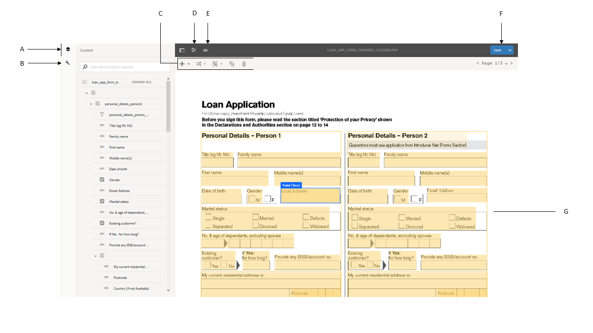

# Revisar e corrigir formulários convertidos{#review-and-correct-converted-forms}

O serviço de Automated forms conversion do AEM Forms (AFCS) identifica campos, conteúdo e layout do documento de PDF de entrada e converte o documento de PDF em um formulário adaptável. O formulário adaptável de saída pode ter alguns campos ausentes ou convertidos incorretamente. Você pode usar o editor de Revisar e corrigir para fazer melhorias nos campos identificados e gerar novamente o formulário adaptável para obter uma saída mais próxima da experiência desejada. Após a primeira conversão, você pode abrir o documento de PDF de entrada no editor para:

* Exibir todos os campos e conteúdos identificados durante a conversão
* Identifique os campos e o conteúdo ausente durante a conversão
* Verifique o tipo de um campo e altere seu tipo, se necessário
* Verificar as tabelas identificadas, redimensionar as colunas e modificar o conteúdo da célula
* Remover campos identificados incorretamente

Depois de fazer as alterações necessárias, reenvie os PDF forms para o serviço de conversão. Em uma conversão bem-sucedida, os ativos atualizados, incluindo o formulário adaptável e o esquema, são baixados para a instância do AEM Forms. Você pode repetir o processo até que a experiência desejada seja alcançada. 

Você precisa do navegador Google Chrome, Mozilla FireFox ou Microsoft Edge para usar o editor de revisão e correção. O editor não é compatível com o Internet Explorer.

## Bem-vindo ao editor de revisão e correção {#welcome-to-review-and-correct-editor}

O editor de Revisar e corrigir oferece uma interface fácil de usar. Ele tem os seguintes componentes:

* Navegador de conteúdo: é possível usar o navegador de conteúdo para alterar a posição de um elemento. O navegador de conteúdo permite arrastar e soltar um objeto de formulário para alterar sua posição. Por exemplo, mover uma tabela antes de uma caixa de texto. Ela altera a ordem de tabulação do formulário adaptável de saída de acordo.
* Navegador de propriedades: exibe as propriedades de um campo selecionado. Também é possível modificar as propriedades.
* Barra de ferramentas: a barra de ferramentas está na parte superior do editor. Ele exibe ferramentas para adicionar, modificar, agrupar, desagrupar e excluir campos.
* Abrir propriedades: a opção Abrir propriedades é exibida ao tocar no ícone . Você pode clicar em abrir propriedades para abrir propriedades de formulário e exibir opções adicionais.
* Botão Filtrar: o botão Filtrar  está na parte superior do editor. Ela permite filtrar os campos para exibir somente textos, campos, grupos de escolha, painéis ou todos os componentes.
* Botão Salvar: o botão **[!UICONTROL Save]** está no canto superior direito do editor. Você também pode usar a seta ao lado do botão Save para exibir a opção de envio do formulário para conversão.

* Formulário PDF: o editor exibe o documento PDF de origem e o sobrepõe aos campos identificados. Você pode usar as ferramentas da barra de ferramentas para modificar os campos.
* Páginas: um formulário de origem pode ter várias páginas. O editor fornece um botão no canto superior direito para navegar entre as páginas.

**A.** Navegador de Conteúdo **B.** Navegador de Propriedades **C.** Barra de Ferramentas **D.** Botão de Propriedades **E.** Botão de Filtro **F.** Botão Salvar **G.** formulário PDF sobreposto aos campos identificados

Após a primeira conversão bem-sucedida, o serviço de conversão sobrepõe o documento do PDF de origem aos campos e componentes identificados. Esses campos ou componentes são do tipo: Texto, Campo, Painel, Grupo de escolha e tabela:

* Texto: texto sem formatação no documento PDF de origem. Por exemplo, o texto do Aplicativo de empréstimo na imagem exibida acima.
* Campo: combinação de texto ou rótulo de ícone associado a um valor ou caixa de entrada. Por exemplo, o Nome do primeiro campo na imagem acima. Ele tem um rótulo de texto e uma caixa de entrada. Um campo é compatível com tipos de dados de texto, numérico, suspenso, data, email, número de telefone, assinatura, moeda e senha.
* Painel: Coleção lógica de conteúdo e componentes. Por exemplo, os painéis Detalhes pessoais da Pessoa 1 e da Pessoa 2 na imagem acima.
* Grupo de opções: Combinação de texto associado às opções de múltipla escolha: caixa de seleção e botão de opção. Por exemplo, Estado civil e Cliente existente na imagem acima.\
  Com base na legenda do grupo de opções e em suas opções de múltipla escolha, o serviço de conversão converte automaticamente um grupo de opções em um botão de opção de seleção única ou em uma caixa de seleção de seleção múltipla. Por exemplo, se houver **Selecione qualquer um** como a legenda do grupo de opções ou se as opções de múltipla escolha permitirem selecionar apenas uma opção, **Sim** ou **Não**, o serviço de conversão converterá automaticamente o grupo de opções em um botão de opção de seleção única. Da mesma forma, se houver **Selecionar tudo que se aplique** ou **Selecionar vários** como a legenda do grupo de opções ou se as opções de várias opções permitirem selecionar várias opções, o serviço de conversão converterá automaticamente o grupo de opções em uma caixa de seleção de várias opções.

* Tabela: uma tabela 2d com informações representadas em colunas e linhas. Você pode adicionar ou remover linhas ou colunas de uma tabela.

## Começar a revisar uma conversão {#start-reviewing-a-conversion}

Após a primeira conversão bem-sucedida, o serviço de conversão sobrepõe o documento do PDF de origem aos campos e componentes identificados. É possível fazer melhorias nos campos identificados e regenerar o formulário adaptável para obter uma saída mais próxima da experiência desejada. Você pode começar a revisar uma conversão somente após a primeira conversão bem-sucedida.

### Antes de começar {#before-you-start}

* O editor de revisão e correção não oferece suporte a fragmentos. Não use o editor para revisar conversões que tiveram a opção **Extrair Fragmento** habilitada durante as conversões. Você pode usar o [editor de formulários adaptáveis](https://helpx.adobe.com/experience-manager/6-5/forms/using/introduction-forms-authoring.html) para essas conversões.

* O editor de Revisar e Corrigir não tem uma ação de desfazer. Use o botão Salvar somente para salvar permanentemente as alterações.

### Iniciar a revisão {#start-the-review}

Para começar a revisar conversões, selecione o documento do PDF de origem usado para conversão e selecione e toque em **Revisar conversões**. O editor de Revisar e corrigir é aberto em uma nova guia. Você pode começar a revisar conversões. Execute as seguintes verificações básicas antes de começar a corrigir qualquer outro problema:

1. **Verificar tipo de todos os campos**: o serviço de conversão pode atribuir um tipo incorreto a um campo. Por exemplo, o texto de tipo é atribuído em vez do telefone ao campo do telefone celular. Você pode passar o mouse sobre um campo para encontrar o tipo do campo.

   Para alterar o tipo de um campo, selecione o campo, abra o navegador de propriedades, selecione um valor no menu suspenso **[!UICONTROL Type]** e toque em **[!UICONTROL Save]**. O tipo foi alterado.

   

1. **Remover painéis extras**: o serviço de conversão pode gerar painéis extras. Por exemplo, um subpainel extra é incluído no painel principal, um espaço vazio é convertido em um painel e uma caixa de seleção é convertida em um painel. Revise os limites de todos os painéis e remova os painéis extras. Você pode usar o botão de filtro  ou o navegador de conteúdo para exibir todos os painéis.

   Você pode excluir ou desagrupar um painel para removê-lo. Ao usar a opção de exclusão, os campos ou componentes secundários do painel também são excluídos:

   * Para excluir um painel, selecione-o e toque no ícone excluir  na barra de ferramentas. No diálogo de confirmação, toque em **[!UICONTROL Confirm]**. Toque em **[!UICONTROL Save]** para salvar as alterações.

   * Para desagrupar um painel, selecione-o e toque no ícone de desagrupar na barra de ferramentas. O painel é desagrupado e os campos secundários do painel desagrupado são ajustados para o campo principal. Toque em **[!UICONTROL Save]** para salvar as alterações.

1. **Criar grupos lógicos de texto**: valide os textos identificados para integridade e correção. Verifique também se os textos estão logicamente posicionados em painéis ou grupos corretos. Por exemplo, em um layout de várias colunas, os textos de um grupo lógico são colocados em outro grupo.

   * Para revisar a integridade e a correção do texto, use o botão de filtro  para exibir somente texto, clique em cada texto e valide. Corrija os problemas de ortografia, digitação ou gramática, se houver.

   * Para adicionar texto ao formulário, toque no botão + e em **[!UICONTROL Text]**. Draw a caixa, abra o navegador de propriedades e digite o texto a ser adicionado à caixa Conteúdo.

1. **Tabelas de revisão:** verifique se todas as bordas da tabela estão identificadas. Além disso, verifique se o conteúdo das células está identificado corretamente.

   * Para identificar bordas perdidas, use a opção **[!UICONTROL Add Column]** ou **[!UICONTROL Add Row]**.

   * Para remover bordas extras, use a opção **[!UICONTROL Delete Column]** ou **[!UICONTROL Delete Row]**.

Depois de fazer as alterações necessárias, toque no botão **[!UICONTROL Save & Convert]** para reenviar os PDF forms para o serviço de conversão. Cada campo é convertido em um componente de campo adaptável correspondente. Após a conversão, os ativos atualizados, incluindo o formulário adaptável e o esquema, são baixados para a instância do AEM Forms. Dependendo da complexidade do formulário, o serviço pode levar algum tempo para concluir a conversão.

Depois de executar as verificações básicas, você pode revisar o formulário para corrigir problemas específicos da organização. Esses problemas podem estar relacionados à adição de campos ausentes e muito mais. Você pode exibir a seção [Usar as ferramentas de Revisão e Correção do editor](review-correct-ui-edited.md#use-the-review-and-correct-editor-tools) para saber mais sobre todas as ferramentas que o editor fornece para corrigir esses problemas.

Você também pode trabalhar no reconhecimento de problemas idênticos que ocorrem em quase todos os seus formulários e relatar esses padrões ao Adobe. Use o editor de Revisar e corrigir até que a experiência desejada seja alcançada.

## Usar as ferramentas do editor Revisar e corrigir {#use-the-review-and-correct-editor-tools}

Com o Editor de revisão e correção, é possível:

* [Adicionar um componente ao formulário](review-correct-ui-edited.md#add-a-component-to-the-form)
* [Adicionar ou editar uma tabela](review-correct-ui-edited.md)
* [Alterar tipo de um componente](review-correct-ui-edited.md#change-type-a-component)

* [Criar ou remover um painel](review-correct-ui-edited.md#create-or-remove-a-panel)
* [Excluir um painel ou componente](review-correct-ui-edited.md#delete-a-panel-or-component)
* [Definir propriedades de um componente](review-correct-ui-edited.md#set-properties-of-a-component)
* [Enviar um formulário para conversão](review-correct-ui-edited.md#send-a-form-for-conversion)

### Adicionar um componente ao formulário {#add-a-component-to-the-form}

O serviço de conversão pode não identificar alguns componentes do formulário impresso. Por exemplo, em um componente **Data de nascimento** de um formulário, não é identificado durante a conversão. Você pode usar a ferramenta **+** para ajudar a identificar esses componentes. A ferramenta permite adicionar componentes de texto, campo, grupo de opções, tabela e painel.

Para adicionar um componente ao formulário, toque em **[!UICONTROL +]** e em **[!UICONTROL Field]**. Draw uma caixa que cobre o rótulo e a caixa de entrada do campo. Por exemplo, a imagem de exemplo acima usa o componente de campo para adicionar o rótulo e a caixa de valor **Data de Nascimento** abaixo dele ao formulário. Ao desenhar a caixa, o serviço de conversão identifica o tipo do campo. Você pode alterar o tipo de campo do navegador de propriedades, se necessário. Depois de criar o componente, abra o navegador de propriedades e defina as propriedades do componente.

Toque no botão **[!UICONTROL Save]** para salvar as modificações ou use o botão **[!UICONTROL Save & Convert]** para reenviar os PDF forms para o serviço de conversão.

### Adicionar ou editar uma tabela {#addedittable}

A conversão pode deixar algumas células, limites ou conteúdo de uma célula de tabela não identificados. Por exemplo, uma linha de uma tabela não é identificada. Você pode usar o editor de Revisar e corrigir para identificar esses itens. Você pode executar as seguintes ações em uma tabela:

* Para selecionar uma tabela, clique em qualquer célula da tabela.
* Para modificar propriedades de uma célula, como nome, título ou tipo, clique duas vezes em uma célula. Também é possível clicar duas vezes na célula para modificar o conteúdo, marcar um campo como obrigatório e selecionar outras propriedades.
* Para adicionar/identificar uma tabela completamente nova ou não identificada ao formulário, use a ferramenta **[!UICONTROL +]**.
* Para redimensionar células ou linhas de uma tabela, clique uma vez na área vazia da tabela, passe o mouse sobre o limite da linha ou da coluna, quando o ponteiro do cursor mudar, selecione e mova o limite. Após o redimensionamento, clique em **[!UICONTROL Done]** para confirmar as alterações. Você pode pressionar a tecla **[!UICONTROL ESC]** para descartar o redimensionamento.

* Para adicionar ou excluir linhas ou colunas, selecione uma célula na linha da tabela e selecione a opção **[!UICONTROL Add Row]**, **[!UICONTROL Add Column]**, **[!UICONTROL Delete Row]** ou **[!UICONTROL Delete Column]** no menu .

* Para dividir uma célula em uma tabela, selecione a opção **[!UICONTROL Spilt Vertical]** ou **[!UICONTROL Split Horizontal]** no menu .

* Para mesclar células de uma tabela, selecione as células a serem mescladas e selecione a opção **[!UICONTROL Merge Cells]** no menu de tabela .

### Alterar tipo de um componente {#change-type-a-component}

O serviço de conversão pode criar alguns campos do tipo incorreto. Por exemplo, na imagem a seguir, o campo **Gênero** é identificado incorretamente como um campo **Texto**. Além disso, o conteúdo do rótulo está incorreto. O campo deve ser um tipo de campo de escolha e o rótulo deve ser Gender. Para alterar o tipo de um componente e corrigir seu rótulo:

Selecione o campo a ser convertido, toque em  e em um tipo de campo. O campo é convertido no tipo de campo selecionado. Um campo pode ser convertido apenas em tipos listados na tabela a seguir. Um componente do painel só pode ser desagrupado, não transformado.

| **Componente** | **Converte em** |
|---|---|
| Texto | Campo ou grupo de escolha |
| Texto | Texto ou Grupo de Escolha |
| Grupo de escolha | Texto ou painel |

Após a conversão, abra o navegador de propriedades, especifique o rótulo e especifique outras propriedades necessárias. Toque no botão **[!UICONTROL Save]** para salvar as modificações ou use o botão Salvar e converter para reenviar os PDF forms para o serviço de conversão.

### Criar ou remover um painel {#create-or-remove-a-panel}

O serviço de conversão agrega componentes relacionados e conteúdo de formulários impressos a um painel. Por exemplo, o formulário pode ter um painel de endereços com campos como, nome, nº do gráfico, área, cidade, estado, CEP e país. Esses campos são agrupados em um painel. Um formulário pode ter vários painéis.

O serviço de conversão pode criar painéis que têm componentes sem relação com outros ou deixa um componente relativo fora do painel. Você pode usar as ferramentas Agrupar ou Desagrupar para corrigir esses painéis:

* Para remover um painel, selecione-o e toque em desagrupar . O painel é removido e os componentes secundários do painel são movidos para o componente principal. Você também pode usar a opção [excluir componente](review-correct-ui-edited.md#delete-a-panel-or-component) para excluir um painel e seus filhos.

* Para criar um painel, use a tecla Ctrl (no Windows ou Linux) ou a tecla Control (no Mac) para selecionar componentes relacionados e toque em  para criar um painel. Abra o navegador de propriedades para especificar as propriedades do painel.

Toque no botão **[!UICONTROL Save]** para salvar as modificações ou use o botão **[!UICONTROL Save & Convert]** para reenviar os PDF forms para o serviço de conversão.

### Excluir um painel ou componente {#delete-a-panel-or-component}

O serviço de conversão pode identificar alguns painéis ou componentes incorretos. A maioria desses componentes desses painéis não está relacionada. Você pode excluir esses painéis ou componentes.

Para excluir um painel ou componente, selecione um painel ou componente e toque no ícone excluir . Na caixa de diálogo de confirmação, toque em **[!UICONTROL Confirm]**. O painel ou componente selecionado é excluído. Ao excluir um painel, todos os filhos dele também são excluídos. Você pode usar a tecla Ctrl (no Windows ou Linux) ou a tecla Control (no Mac) para selecionar vários componentes ou painéis.

### Definir propriedades de um componente {#set-properties-of-a-component}

Cada componente do formulário tem um conjunto de propriedades como nome, título, tipo. Para definir as propriedades de um componente, selecione o componente e toque em navegador de propriedades. As propriedades do componente selecionado são exibidas. Altere ou defina as propriedades.

Toque no botão **[!UICONTROL Save]** para salvar as modificações ou use o botão **[!UICONTROL Save & Convert]** para reenviar os PDF forms para o serviço de conversão.

### Enviar um formulário para conversão {#send-a-form-for-conversion}

Depois de fazer todas as alterações necessárias no Editor de revisão e correção, você pode reenviar o formulário para conversão. Para enviar o formulário para conversão, toque em **[!UICONTROL Save & Convert]**. O **[!UICONTROL Sent for conversion label]** é aplicado à pasta que contém o documento de origem e o formulário de origem atualizado é carregado para o serviço de conversão em execução no Adobe I/O.

Dependendo da complexidade do formulário, o serviço de conversão pode levar algum tempo para converter o formulário. Após a conclusão da conversão, o formulário adaptável convertido e os ativos relacionados são baixados para o computador. Você pode revisar o formulário no editor após a conclusão da conversão e abrir o formulário adaptável no [editor de formulários adaptáveis](https://helpx.adobe.com/experience-manager/6-5/forms/using/introduction-forms-authoring.html) para o conjunto final de correções, se necessário.

Se você reenviar um formulário para conversão depois de atualizar o formulário no editor de formulários adaptáveis, todas as alterações feitas no formulário adaptável serão perdidas. Você pode abrir um formulário no editor de revisão e correção somente após uma conversão bem-sucedida.

<!--
Comment Type: draft

<h3>Open adaptive forms editor</h3>
-->

<!--
Comment Type: draft

There can be instances where you require adaptive forms editor to make the changes like, applying a different theme to the form or fixing tables. Once you have made all the required changes in Review and Correct editor and converted the form, you can open your form in adaptive forms editor to make the final set of changes.

To open the form with adaptive forms editor, tap the  icon, and tap <strong>Open Adaptive Form Editor</strong>. The form opens in adaptive form editor. 

## Previous {#previous}

[Use Automated Forms Conversion service](convert-existing-forms-to-adaptive-forms.md)
-->
