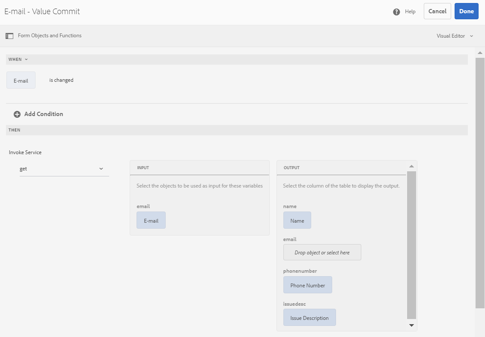

# Integrar formulário adaptável ao banco de dados usando o fluxo de trabalho AEM {#submit-forms-to-database-using-forms-portal}

O serviço de automated forms conversion (AFCS) permite converter um formulário de PDF não interativo, um formulário do Acro ou um formulário de PDF baseado em XFA em um formulário adaptável. Ao iniciar o processo de conversão, você tem a opção de gerar um formulário adaptável com ou sem vínculos de dados.

Se você optar por gerar um formulário adaptável sem associações de dados, será possível integrar o formulário adaptável convertido com um modelo de dados de formulário, esquema XML ou esquema JSON após a conversão. Para o modelo de dados de formulário, é necessário vincular campos de formulário adaptáveis manualmente com o modelo de dados de formulário. No entanto, se você gerar um formulário adaptável com vinculações de dados, o serviço de conversão associará automaticamente os formulários adaptáveis a um esquema JSON e criará uma vinculação de dados entre os campos disponíveis no formulário adaptável e no esquema JSON. Em seguida, você pode integrar o formulário adaptável a um banco de dados de sua escolha, preencher dados no formulário e enviá-lo para o banco de dados. Da mesma forma, após a integração bem-sucedida com o banco de dados, é possível configurar campos no formulário adaptável convertido para recuperar valores do banco de dados e preencher previamente os campos de formulário adaptável.

A figura a seguir descreve os diferentes estágios de integração de um formulário adaptável convertido com um banco de dados:


Este artigo descreve as instruções passo a passo para executar com êxito todos esses estágios de integração.

## Pré-requisitos {#pre-requisites}

* Configurar uma instância de autor do AEM 6.4 ou 6.5
* Instalar [service pack mais recente](https://helpx.adobe.com/br/experience-manager/aem-releases-updates.html) para sua instância do AEM
* Versão mais recente do pacote complementar do AEM Forms
* Configurar [serviço Automated forms conversion](configure-service.md)
* Configurar um banco de dados. O banco de dados usado na implementação da amostra é o MySQL 5.6.24. No entanto, é possível integrar o formulário adaptável convertido a qualquer banco de dados de sua escolha.

## Exemplo de formulário adaptável {#sample-adaptive-form}

Para executar o caso de uso para integrar formulários adaptáveis convertidos ao banco de dados usando um fluxo de trabalho AEM, baixe o seguinte arquivo de PDF de amostra.

Você pode baixar o exemplo de formulário Fale Conosco usando:

[Obter arquivo](assets/sample_contact_us_form.pdf)

O arquivo PDF serve como entrada para o serviço de Automated forms conversion (AFCS). O serviço converte esse arquivo em um formulário adaptável. A imagem a seguir representa o formulário entre em contato conosco de amostra em formato PDF.


## Instale o arquivo mysql-connector-java-5.1.39-bin.jar {#install-mysql-connector-java-file}

Execute as seguintes etapas, em todas as instâncias de autor e publicação, para instalar o arquivo mysql-connector-java-5.1.39-bin.jar:

1. Navegue até `http://server:port/system/console/depfinder` e procure pelo pacote com.mysql.jdbc.
1. Na coluna Exportado por, verifique se o pacote foi exportado por algum pacote. Continue se o pacote não for exportado por um pacote.
1. Navegue até `http://server:port/system/console/bundles` e clique em **[!UICONTROL Install/Update]**.
1. Clique em **[!UICONTROL Choose File]** e navegue para selecionar o arquivo mysql-connector-java-5.1.39-bin.jar. Além disso, **[!UICONTROL Start Bundle]** e **[!UICONTROL Refresh Packages]** caixas de seleção.
1. Clique em **[!UICONTROL Install]** ou **[!UICONTROL Update]**. Após a conclusão, reinicie o servidor.
1. (Somente para Windows) Desative o firewall do sistema para o seu sistema operacional.

## Preparar dados para o modelo de formulário {#prepare-data-for-form-model}

A Integração de dados do AEM Forms permite configurar e conectar-se a diferentes fontes de dados. Depois de gerar um formulário adaptável usando o processo de conversão, você pode definir o modelo de formulário com base em um modelo de dados de formulário, XSD ou um esquema JSON. Você pode usar um banco de dados, o Microsoft Dynamics ou qualquer outro serviço de terceiros para criar um modelo de dados de formulário.

Este tutorial usa o banco de dados MySQL como a fonte para criar um modelo de dados de formulário. Crie um esquema no banco de dados e adicione **contactus** para o esquema com base nos campos disponíveis no formulário adaptável.


Você pode usar a seguinte instrução DDL para criar a **contactus** tabela no banco de dados.

```sql
CREATE TABLE `contactus` (
   `name` varchar(45) NOT NULL,
   `email` varchar(45) NOT NULL,
   `phonenumber` varchar(10) DEFAULT NULL,
   `issuedesc` varchar(1000) DEFAULT NULL,
   PRIMARY KEY (`email`)
 ) ENGINE=InnoDB DEFAULT CHARSET=utf8
```

## Configurar conexão entre a instância do AEM e o banco de dados {#configure-connection-between-aem-instance-and-database}

Execute as seguintes etapas de configuração para criar uma conexão entre a instância do AEM e o banco de dados MYSQL:

1. Vá para a página Configuração do console da Web do AEM em `http://server:port/system/console/configMgr`.
1. Localize e clique para abrir **[!UICONTROL Apache Sling Connection Pooled DataSource]** no modo de edição, na Configuração do console da Web. Especifique os valores das propriedades conforme descrito na tabela a seguir:

   <table> 
    <tbody> 
    <tr> 
    <th><strong>Propriedade</strong></th> 
    <th><strong>Valor</strong></th> 
    </tr> 
    <tr> 
    <td><p>Nome da fonte de dados</p></td> 
    <td><p>Um nome de fonte de dados para filtrar drivers do pool de fonte de dados.</p></td>
    </tr>
    <tr> 
    <td><p>Classe de driver JDBC</p></td> 
    <td><p>com.mysql.jdbc.Driver</p></td>
    </tr>
    <tr> 
    <td><p>URI da conexão JDBC</p></td> 
    <td><p>jdbc:mysql://[host]:[porta]/[nome_do_esquema]</p></td>
    </tr>
    <tr> 
    <td><p>Nome de usuário</p></td> 
    <td><p>Um nome de usuário para autenticar e executar ações em tabelas do banco de dados</p></td>
    </tr>
    <tr> 
    <td><p>Senha</p></td> 
    <td><p>Senha associada ao nome de usuário</p></td>
    </tr>
    <tr> 
    <td><p>Isolamento de transação</p></td> 
    <td><p>READ_COMMITTED</p></td>
    </tr>
    <tr> 
    <td><p>Máximo de conexões ativas</p></td> 
    <td><p>1000</p></td>
    </tr>
    <tr> 
    <td><p>Máximo de Conexões Ociosas</p></td> 
    <td><p>100</p></td>
    </tr>
    <tr> 
    <td><p>Mínimo de conexões ociosas</p></td> 
    <td><p>10</p></td>
    </tr>
    <tr> 
    <td><p>Tamanho inicial</p></td> 
    <td><p>10</p></td>
    </tr>
    <tr> 
    <td><p>Espera Máxima</p></td> 
    <td><p>100000</p></td>
    </tr>
     <tr> 
    <td><p>Teste ao tomar emprestado</p></td> 
    <td><p>Marcado</p></td>
    </tr>
     <tr> 
    <td><p>Teste enquanto ocioso</p></td> 
    <td><p>Marcado</p></td>
    </tr>
     <tr> 
    <td><p>Consulta de validação</p></td> 
    <td><p>Os valores de exemplo são SELECT 1(mysql), select 1 from dual(oracle), SELECT 1(MS Sql Server) (validationQuery)</p></td>
    </tr>
     <tr> 
    <td><p>Tempo limite de consulta de validação</p></td> 
    <td><p>10000</p></td>
    </tr>
    </tbody> 
    </table>

## Criar modelo de dados de formulário {#create-form-data-model}

Depois de configurar o MYSQL como a fonte de dados, execute as seguintes etapas para criar um modelo de dados de formulário:

1. Na instância do autor AEM, navegue até **[!UICONTROL Forms]** > **[!UICONTROL Data Integrations]**.

1. Toque **[!UICONTROL Create]** > **[!UICONTROL Form Data Model]**.

1. No **[!UICONTROL Create Form Data Model]** assistente, especificar **workflow_submit** como o nome do modelo de dados de formulário. Toque **[!UICONTROL Next]**.

1. Selecione a fonte de dados MYSQL que você configurou na seção anterior e toque em **[!UICONTROL Create]**.

1. Toque **[!UICONTROL Edit]** e expanda a fonte de dados listada no painel esquerdo para selecionar **contactus** tabela, **[!UICONTROL get]**, e **[!UICONTROL insert]** serviços e toque em **[!UICONTROL Add Selected]**.

   

1. Selecione o objeto de modelo de dados no painel direito e toque em **[!UICONTROL Edit Properties]**. Selecionar **[!UICONTROL get]** e **[!UICONTROL insert]** de **[!UICONTROL Read Service]** e **[!UICONTROL Write Service]** listas suspensas. Especifique os argumentos para o serviço de leitura e toque em **[!UICONTROL Done]**.

1. No **[!UICONTROL Services]** , selecione a **[!UICONTROL get]** serviço e toque em **[!UICONTROL Edit Properties]**. Selecione o **[!UICONTROL Output Model Object]**, desative o **[!UICONTROL Return array]** alterne e toque em **[!UICONTROL Done]**.

1. Selecione o **[!UICONTROL Insert]** serviço e toque em **[!UICONTROL Edit Properties]**. Selecione o **[!UICONTROL Input Model Object]** e toque em **[!UICONTROL Done]**.

1. Toque **[!UICONTROL Save]** para salvar o modelo de dados do formulário.

Você pode baixar o modelo de dados de formulário de amostra usando:

[Obter arquivo](assets/DownloadedFormsPackage_1497728018502500.zip)

## Gerar formulários adaptáveis com vinculação JSON {#generate-adaptive-forms-with-json-binding}

Use o [Serviço do Automated forms conversion (AFCS) para conversão](convert-existing-forms-to-adaptive-forms.md) o [Formulário Fale Conosco](#sample-adaptive-form) para um formulário adaptável com vinculação de dados. Certifique-se de não selecionar a opção **[!UICONTROL Generate adaptive form(s) without data bindings]** ao gerar o formulário adaptável.


Selecione o convertido **Formulário Fale Conosco** disponível no **[!UICONTROL output]** pasta em **[!UICONTROL Forms & Documents]** e toque em **[!UICONTROL Edit]**. Toque **[!UICONTROL Preview]**, insira valores nos campos de formulário adaptável e toque em **[!UICONTROL Submit]**.

Efetue logon no **crx-repository** e navegue até */content/forms/fp/admin/submit/data* para exibir os valores enviados no formato JSON. A seguir estão exemplos de dados no formato JSON ao enviar o arquivo **Entre em contato** formulário adaptável:

```json
{
  "afData": {
    "afUnboundData": {
      "data": {}
    },
    "afBoundData": {
      "data": {
        "name1": "Gloria",
        "email": "abc@xyz.com",
        "phone_number": "2346578965",
        "issue_description": "Test message"
      }
    },
    "afSubmissionInfo": {
      "computedMetaInfo": {},
      "stateOverrides": {},
      "signers": {},
      "afPath": "/content/dam/formsanddocuments/docs_conversion/output/sample_form_json",
      "afSubmissionTime": "20191204014007"
    }
  }
}
```

Agora é necessário criar um modelo de fluxo de trabalho que possa processar esses dados e enviá-los ao banco de dados MYSQL usando o modelo de dados de formulário criado nas seções anteriores.

## Criar um modelo de fluxo de trabalho para processar dados JSON {#create-workflow-model}

Execute as seguintes etapas para criar um modelo de fluxo de trabalho e enviar os dados do formulário adaptável para o banco de dados:

1. Abra o console Modelos de fluxo de trabalho. O URL padrão é `https://server:port/libs/cq/workflow/admin/console/content/models.html/etc/workflow/models`.

1. Selecionar **[!UICONTROL Create]**, depois **[!UICONTROL Create Model]**. A variável **[!UICONTROL Add Workflow Model]** será exibida.

1. Insira o **[!UICONTROL Title]** e **[!UICONTROL Name]** (opcional). Por exemplo, **workflow_json_submit**. Toque **[!UICONTROL Done]** para criar o modelo.

1. Selecione o modelo de fluxo de trabalho e toque em **[!UICONTROL Edit]** para abrir o modelo no modo de edição. Toque em + e adicionar **[!UICONTROL Invoke Form Data Model Service]** etapa para o modelo de fluxo de trabalho.

1. Toque no **[!UICONTROL Invoke Form Data Model Service]** pisque e toque .

1. No **[!UICONTROL Form Data Model]** selecione o modelo de dados de formulário criado na guia **[!UICONTROL Form Data Model path]** e selecione **[!UICONTROL insert]** do **[!UICONTROL Service]** lista suspensa.

1. No **[!UICONTROL Input for Service]** selecione **[!UICONTROL Provide input data using literal, variable, or a workflow metadata, and a JSON file]** na lista suspensa, selecione **[!UICONTROL Map input fields from input JSON]** , selecione **[!UICONTROL Relative to payload]** e fornecer **data.xml** como o valor de **[!UICONTROL Select input JSON document using]** campo.

1. No **[!UICONTROL Service Arguments]** , forneça os seguintes valores para os argumentos do modelo de dados de formulário:

   

   Observe que os campos do modelo de dados de formulário, por exemplo, contactus dot name, estão mapeados para **afData.afBoundData.data.name1**, que se refere às vinculações do esquema JSON para o formulário adaptável enviado.

## Configurar envio de formulário adaptável {#configure-adaptive-form-submission}

Execute as seguintes etapas para enviar o formulário adaptável para o modelo de fluxo de trabalho criado na seção anterior:

1. Selecione o formulário Fale Conosco convertido disponível na **[!UICONTROL output]** pasta em **[!UICONTROL Forms & Documents]** e toque em **[!UICONTROL Edit]**.

1. Abra as propriedades do formulário adaptável tocando em **[!UICONTROL Form Container]** e toque em .

1. No **[!UICONTROL Submission]** , selecione **[!UICONTROL Invoke an AEM workflow]** do **[!UICONTROL Submit Action]** selecione o modelo de fluxo de trabalho criado na seção anterior e especifique **data.xml** no **[!UICONTROL Data File Path]** campo.

1. Toque em  para salvar as propriedades.

1. Toque **[!UICONTROL Preview]**, insira valores nos campos de formulário adaptável e toque em **[!UICONTROL Submit]**. Os valores enviados agora são exibidos na tabela do banco de dados MYSQL, em vez de **crx-repository**.

## Configurar formulário adaptável para preencher previamente os valores do banco de dados

Execute as seguintes etapas para configurar o formulário adaptável para preencher previamente os valores do banco de dados MYSQL com base na chave primária definida na tabela (Email neste caso):

1. Toque no **E-mail** no formulário adaptável e toque em .

1. Toque **[!UICONTROL Create]** e selecione **[!UICONTROL is changed]** do **[!UICONTROL Select State]** lista suspensa na **[!UICONTROL When]** seção.

1. No **[!UICONTROL Then]** , selecione **[!UICONTROL Invoke Service]** e **obter** como o serviço para o modelo de dados de formulário criado em uma seção anterior deste artigo.

1. Selecionar **E-mail** no **[!UICONTROL Input]** e os três campos restantes do modelo de dados de formulário, **Nome**, **Número de telefone**, e **Descrição do problema** no **[!UICONTROL Output]** seção. Toque **[!UICONTROL Done]** para salvar as configurações.

   

   Como resultado, com base nas entradas de E-mail existentes no banco de dados MYSQL, você pode preencher previamente os valores dos três campos restantes no **[!UICONTROL Preview]** modo do formulário adaptável. Por exemplo, se você especificar aya.tan@xyz.com na variável **E-mail** (com base nos dados existentes no [Preparar modelo de dados do formulário](#prepare-data-for-form-model) deste artigo) e guia para fora do campo, os três campos restantes, **Nome**, **Número de telefone**, e **Descrição do problema** é exibido automaticamente no formulário adaptável.

Você pode baixar a amostra de formulário adaptável convertido usando:

[Obter arquivo](assets/DownloadedFormsPackage_1498226829041200.zip)
