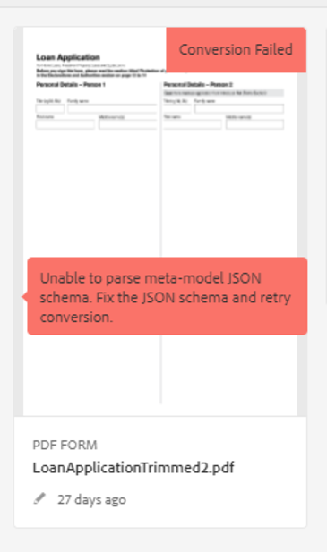

# Solução de problemas do serviço de conversão automática de formulários (AFCS)

O documento fornece etapas básicas de solução de problemas para erros comuns.

<!--The article provides information on installation, configuration and administration issues that may arise in an Automated Forms Conversion Service production environment. -->

## Erros comuns {#commonerrors}

| Erro | Exemplo |
|--- |--- |
| **Mensagem de erro**   O cabeçalho do token de acesso não está disponível.    **Motivo**   Um administrador criou várias configurações do IMS ou a configuração do IMS não pode acessar o serviço AFCS na Adobe Cloud.   **Solução**   Se houver várias configurações, exclua todas as configurações e [crie uma nova configuração](configure-service.md#obtainpubliccertificates).   Se houver uma única configuração, use a **Verificação de integridade** para [verificar a conectividade](configure-service.md#createintegrationoption). |  |
| **Mensagem de erro**   Não é possível conectar ao serviço.    **Motivo**   Um URL de serviço incorreto ou nenhum URL de serviço é mencionado nos serviços em nuvem do Serviço de Automated forms conversion (AFCS).   **Resolução**   Correto [URL do serviço](configure-service.md#configure-the-cloud-service) no Automated forms conversion Service (AFCS) Cloud services. |  |
| **Mensagem de erro**   O serviço falhou ao converter o formulário.    **Motivo**   Problemas de conectividade de rede da sua parte, o serviço está inativo devido à manutenção agendada ou interrupção no Adobe Cloud.   **Solução**   Resolva os problemas de conectividade de rede da sua parte e verifique o status do serviço em https://status.adobe.com/ para consultar se há uma interrupção planejada ou não planejada. |  |
| **Mensagem de erro**   O número de páginas é superior a 15.    **Motivo**   O formulário de origem tem mais de 15 páginas.    **Solução**   Use o Adobe Acrobat para dividir os formulários com mais de 15 páginas. Reduza o número de páginas em um formulário para menos de 15. |  |
| **Mensagem de erro**   O número de arquivos é superior a 15.    **Motivo**    A pasta contém mais de 15 formulários.   **Solução**  Coloque o número de formulários em uma pasta igual ou inferior a 15. Reduza o número total de páginas em uma pasta menos de 50. Ajuste o tamanho da pasta para menos de 10 MB. Não conserve formulários em uma subpasta. Organize formulários de origem em um lote de 8 a 15 formulários. |  |
| **Mensagem de erro**   O formato do arquivo de origem não é suportado.    **Motivo**   A pasta que contém formulários de origem tem alguns arquivos não suportados.   **Solução**   O serviço suporta apenas arquivos .xdp e .pdf. Remova os arquivos com qualquer outra extensão da pasta e execute a conversão. |  |
| **Mensagem de erro**   Formulários digitalizados não são suportados.    **Motivo**   O formulário PDF contém apenas imagens digitalizadas do formulário e não contém nenhuma estrutura de conteúdo.   **Solução**   O serviço não oferece suporte à conversão de formulários digitalizados ou de uma imagem de um formulário para um formulário pronto para uso adaptável. No entanto, você usa o Adobe Acrobat para converter a imagem de um formulário em um formulário PDF. Em seguida, use o serviço para converter o formulário PDF em um formulário adaptável. Sempre use uma imagem de alta qualidade do formulário para conversão no Acrobat. Melhora a qualidade da conversão. |  |
| **Mensagem de erro**   Formulários PDF criptografados não são suportados.    **Motivo**   A pasta contém formulários PDF criptografados.   **Solução**   O serviço não oferece suporte à conversão de formulários PDF criptografados em formulários adaptáveis. Remova a criptografia, carregue o formulário não criptografado e execute a conversão. |  |
| **Mensagem de erro**   Não é possível analisar o esquema JSON do metamodelo.    **Motivo**   O esquema JSON fornecido para o serviço não está formatado corretamente, contém caracteres inválidos ou usa sintaxe inválida para mapear componentes.    **Solução**  Verifique a formatação do arquivo JSON. Você pode usar qualquer validador JSON online para verificar a formatação e a estrutura do esquema. Consulte o artigo [Ampliar o metamodelo padrão](extending-the-default-meta-model.md) para obter informações sobre a sintaxe do metamodelo. |  |
| **Erro (somente ambientes locais)**   A variável **[!UICONTROL Source Language]** A opção não lista o idioma correto de um Formulário adaptável.   **Motivo**   A propriedade jcr:language do formulário adaptável não está definida corretamente.    **Resolução**   Abra o CRX-DE lite, acesse `/content/forms/af/`, abra o `jcr:content` e defina o valor do nó para o idioma correto. Para obter a lista de idiomas compatíveis, consulte [Adicionar suporte de localização para localidades sem suporte](https://experienceleague.adobe.com/docs/experience-manager-65/forms/manage-administer-aem-forms/supporting-new-language-localization.html#add-localization-support-for-non-supported-locales). |  |

<!--

<table>
<thead>
<tr>
<th>Error</th>
<th>Example</th>
</tr>
</thead>
<tbody>
<tr>
<td><strong>Error Message</strong> 
 The access token header is not available. 
 <strong>Reason</strong>   An administrator has created multiple IMS configurations or IMS configuration is not able to reach AFCS service on Adobe Cloud.   <strong>Resolution</strong>   If there are multiple configurations, delete all the configurations and <a href="configure-service.md#obtainpubliccertificates">create a new configuration</a>.   If there is a single configuration, use <strong> Health Check </strong> to <a href="configure-service.md#createintegrationoption">check connectivity</a>.</td>
<td></td>
</tr>
<tr>
<td><strong>Error Message</strong>   Unable to connect to the service.    <strong>Reason</strong>   Incorrect service URL or no service URL is mentioned in Automated Forms Conversion Service (AFCS) cloud services.   <strong>Resolution</strong>   Correct <a href="configure-service.md#configure-the-cloud-service">Service URL</a> in Automated Forms Conversion Service (AFCS) Cloud services.</td>
<td></td>
</tr>
<tr>
<td><strong>Error Message</strong>   The service failed to convert the form.    <strong>Reason</strong>   Network connectivity issues at your end, the service is down due to scheduled maintenance, or outage on Adobe Cloud.   <strong>Resolution</strong>   Resolve network connectivity issues at your end and check the status of the service on <a href="https://status.adobe.com/">https://status.adobe.com/</a> for a planned or unplanned outage.</td>
<td></td>
</tr>
<tr>
<td><strong>Error Message</strong>   The number of pages is more than 15.    <strong>Reason</strong>   The source form is more than 15 pages long.    <strong>Resolution</strong>   Use Adobe Acrobat to split forms with more than 15 pages. Bring the number of pages in a form to less than 15.</td>
<td></td>
</tr>
<tr>
<td><strong>Error Message</strong>   The number of files is more than 15.    <strong>Reason</strong>    The folder contains more than 15 forms.   <strong>Resolution</strong>   Bring the number of forms in a folder to less than or equal to 15. Bring the total number of pages in a folder less than 50. Bring the size of the folder to less than 10 MB. Do not keep forms in a sub-folder. Organize source forms into a batch of 8-15 forms.</td>
<td></td>
</tr>
<tr>
<td><strong>Error Message</strong>   The source file format is not supported.    <strong>Reason</strong>   The folder containing source forms have some unsupported files.   <strong>Resolution</strong>   The service supports only .xdp and .pdf files. Remove files with any other extension from the folder and run the conversion.</td>
<td></td>
</tr>
<tr>
<td><strong>Error Message</strong>   Scanned forms are not supported.    <strong>Reason</strong>   The PDF form contains only scanned images of the form and contains no content structure.   <strong>Resolution</strong>   The service does not support converting scanned forms or an image of a form to an adaptive out-of-the-box. However, you use Adobe Acrobat to convert the image of a form to a PDF Form. Then, use the service to convert the PDF Form to an adaptive form. Always use a high-quality image of the form for conversion in Acrobat. It improves the quality of the conversion.</td>
<td></td>
</tr>
<tr>
<td><strong>Error Message</strong>   Encrypted PDF form is not supported.    <strong>Reason</strong>   The folder contains encrypted PDF forms.   <strong>Resolution</strong>   The service does not support converting an encrypted PDF form to an adaptive form. Remove the encryption, upload the non-encrypted form, and run the conversion.</td>
<td></td>
</tr>
<tr>
<td><strong>Error Message</strong>   Unable to parse meta-model JSON schema.    <strong>Reason</strong>   The JSON schema supplied to the service is not properly formatted, contains invalid characters, or uses invalid syntax to map components.    <strong>Resolution</strong>   Check the formatting of the JSON file. You can use any online JSON validator to check the formatting and structure of the schema. See, <a href="extending-the-default-meta-model.md">Extend the default meta-model</a> article for information on meta-model syntax.</td>
<td></td>
</tr>
</tbody>
</table>
-->
